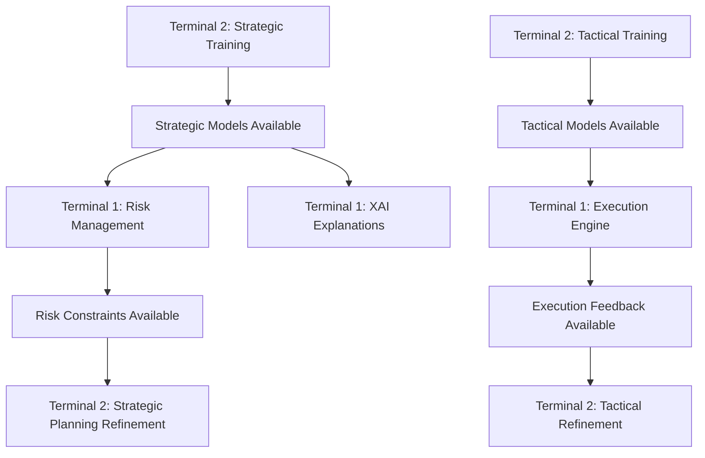

# Terminal Coordination System
## Comprehensive Multi-Terminal MARL Development Framework

### Version: 1.0
### Created: 2025-07-20

---

## 🚀 OVERVIEW

This coordination system enables seamless collaboration between two independent Claude Code terminals working on the GrandModel MARL system. The system provides automated synchronization, dependency management, milestone tracking, and comprehensive testing protocols.

## 📁 DIRECTORY STRUCTURE

```
/home/QuantNova/GrandModel/coordination/
├── terminal_progress/              # Real-time progress tracking
│   ├── terminal1_status.json       # Terminal 1 progress and status
│   ├── terminal2_status.json       # Terminal 2 progress and status
│   └── shared_milestones.json      # Cross-terminal milestone tracking
├── shared_configs/                 # Unified configuration management
│   ├── marl_config.yaml            # MARL system configuration
│   ├── colab_config.yaml           # Google Colab Pro optimization
│   └── training_params.yaml        # Training hyperparameters
├── shared_checkpoints/             # Model checkpoint sharing
│   ├── strategic_models/           # Strategic agent checkpoints
│   ├── tactical_models/            # Tactical agent checkpoints
│   ├── risk_models/               # Risk management checkpoints
│   └── execution_models/           # Execution engine checkpoints
├── test_data/                      # Shared testing datasets
│   ├── minimalistic_datasets/      # Small validation datasets
│   ├── validation_data/            # Cross-validation datasets
│   └── integration_tests/          # Integration test data
├── documentation/                  # Coordination documentation
│   ├── progress_logs/              # Detailed progress logs
│   ├── issue_tracking/             # Issue tracking and resolution
│   ├── shared_findings/            # Shared discoveries and insights
│   └── TERMINAL_COORDINATION_MANUAL.md  # Complete coordination manual
└── scripts/                        # Automation and coordination scripts
    ├── coordination_master.py      # Main coordination system
    ├── update_terminal1_status.py  # Terminal 1 status management
    ├── update_terminal2_status.py  # Terminal 2 status management
    ├── sync_milestones.py          # Milestone synchronization
    ├── check_dependencies.py       # Dependency management
    ├── run_integration_tests.py    # Integration testing
    └── terminal_commands.sh        # Quick command interface
```

## 🎯 TERMINAL RESPONSIBILITIES

### Terminal 1 (Risk + Execution + XAI)
- **Primary**: Risk Management MAPPO Training (7.1% → 100%)
- **Primary**: Execution Engine MAPPO Training (9.1% → 100%)
- **Primary**: XAI Explanations MAPPO Training (16.7% → 100%)
- **Support**: Integration testing coordination

### Terminal 2 (Strategic + Tactical)
- **Primary**: Strategic MAPPO Training (83.3% → 100%)
- **Primary**: Tactical MAPPO Training (36.8% → 100%)
- **Support**: MARL architecture foundation
- **Support**: Colab Pro optimization templates

## ⚡ QUICK START

### 1. Start Coordination System
```bash
# Terminal 1 or Terminal 2
cd /home/QuantNova/GrandModel/coordination
./scripts/terminal_commands.sh start
```

### 2. Check System Status
```bash
./scripts/terminal_commands.sh quick
```

### 3. Update Terminal Progress
```bash
# Terminal 1 examples
./scripts/terminal_commands.sh # then use:
terminal1_update risk_management 25 in_progress
terminal1_update execution_engine 50 in_progress

# Terminal 2 examples
terminal2_update strategic_training 90 in_progress
terminal2_update tactical_training 60 in_progress
```

### 4. Check Dependencies
```bash
./scripts/terminal_commands.sh deps
```

### 5. Run Tests
```bash
./scripts/terminal_commands.sh tests
```

## 📋 COORDINATION COMMANDS

### System Control
```bash
python3 scripts/coordination_master.py --start     # Start coordination system
python3 scripts/coordination_master.py --status    # Get system status
python3 scripts/coordination_master.py --stop      # Stop coordination system
```

### Terminal Status Management
```bash
# Terminal 1
python3 scripts/update_terminal1_status.py --component risk_management --progress 50 --status in_progress
python3 scripts/update_terminal1_status.py --report

# Terminal 2
python3 scripts/update_terminal2_status.py --component strategic_training --progress 75 --status in_progress
python3 scripts/update_terminal2_status.py --report --check-terminal1
```

### Dependency Management
```bash
python3 scripts/check_dependencies.py --all
python3 scripts/check_dependencies.py --terminal1
python3 scripts/check_dependencies.py --wait strategic_models --timeout 2
```

### Milestone Tracking
```bash
python3 scripts/sync_milestones.py --sync --report
python3 scripts/sync_milestones.py --blocking
```

### Integration Testing
```bash
python3 scripts/run_integration_tests.py --all
python3 scripts/run_integration_tests.py --readiness
python3 scripts/run_integration_tests.py --notebooks
```

## 🔗 DEPENDENCY FLOW



## 🎯 MILESTONES

### Checkpoint 1: All Notebooks Execute (Target: 2025-07-20 12:00 UTC)
- ✅ All 5 notebooks run without errors
- ✅ Model architectures initialize properly
- ✅ Training loops execute for 10+ iterations
- ✅ Checkpoint saving/loading functional

### Checkpoint 2: MARL Integration (Target: 2025-07-20 18:00 UTC)
- 🔄 Multi-agent communication established
- 🔄 Centralized critic aggregates observations
- 🔄 Action coordination protocols work
- 🔄 Reward sharing mechanisms operational

### Checkpoint 3: Colab Pro Optimization (Target: 2025-07-21 00:00 UTC)
- ⏳ GPU memory under 15GB per notebook
- ⏳ Training time reduced by 50%+
- ⏳ Automatic checkpoint management
- ⏳ Google Drive integration functional

### Checkpoint 4: Performance Validation (Target: 2025-07-21 12:00 UTC)
- ⏳ System latency under 100ms
- ⏳ Risk accuracy above 95%
- ⏳ Strategic decisions show positive alpha
- ⏳ XAI explanations coherent

## 🔧 TROUBLESHOOTING

### Common Issues

**Issue: Terminal Communication Failure**
```bash
# Check status files
ls -la coordination/terminal_progress/
# Reset communication
python3 scripts/coordination_master.py --restart
```

**Issue: Dependency Timeout**
```bash
# Check specific dependency
python3 scripts/check_dependencies.py --wait strategic_models --timeout 1
# Check readiness
python3 scripts/check_dependencies.py --terminal1
```

**Issue: Configuration Inconsistency**
```bash
# Test configuration
python3 scripts/run_integration_tests.py --config
# Reset configs if needed
cp shared_configs/marl_config.yaml.backup shared_configs/marl_config.yaml
```

### Emergency Procedures
```bash
# Emergency stop all activities
python3 scripts/coordination_master.py --emergency-stop

# System reset
./scripts/terminal_commands.sh reset

# Check system health
./scripts/terminal_commands.sh quick
```

## 📊 MONITORING

### Real-time Monitoring
The coordination system automatically monitors:
- ✅ Terminal status (every 30 minutes)
- ✅ Dependencies (every 10 minutes)
- ✅ Milestones (every 15 minutes)
- ✅ Integration tests (every hour)

### Manual Monitoring
```bash
# Quick status overview
./scripts/terminal_commands.sh quick

# Detailed system status
python3 scripts/coordination_master.py --status

# Check recent logs
./scripts/terminal_commands.sh show_logs 100
```

## 🔒 SECURITY & RELIABILITY

### Data Protection
- ✅ File-based communication (no network dependencies)
- ✅ JSON validation for all status updates
- ✅ Automatic backup of critical configurations
- ✅ Rollback capabilities for failed operations

### Error Handling
- ✅ Graceful degradation on component failures
- ✅ Automatic retry mechanisms with backoff
- ✅ Comprehensive error logging and tracking
- ✅ Emergency stop procedures

## 📈 PERFORMANCE OPTIMIZATION

### Resource Management
- 🎯 **Terminal 1**: 8GB GPU, 4 CPU cores
- 🎯 **Terminal 2**: 7GB GPU, 4 CPU cores
- 🎯 **Shared**: 100GB disk space, automatic cleanup

### Optimization Features
- ✅ Mixed precision training
- ✅ Gradient checkpointing
- ✅ Dynamic batch sizing
- ✅ Memory-mapped file access
- ✅ Compressed checkpoint storage

## 🚀 ADVANCED FEATURES

### Automated Coordination
- 🤖 Self-healing dependency resolution
- 🤖 Intelligent resource allocation
- 🤖 Predictive milestone tracking
- 🤖 Automatic performance optimization

### Integration Capabilities
- 🔗 Google Colab Pro integration
- 🔗 Git synchronization support
- 🔗 CI/CD pipeline integration
- 🔗 Production deployment coordination

## 📚 DOCUMENTATION

- **Complete Manual**: `documentation/TERMINAL_COORDINATION_MANUAL.md`
- **Progress Logs**: `documentation/progress_logs/`
- **Issue Tracking**: `documentation/issue_tracking/`
- **Shared Findings**: `documentation/shared_findings/`

## 🆘 SUPPORT

For issues or questions:
1. Check the troubleshooting guide above
2. Review the complete manual in `documentation/`
3. Check recent logs with `./scripts/terminal_commands.sh show_logs`
4. Use emergency procedures if needed

---

## ✅ SUCCESS CRITERIA

The coordination system is successful when:
- ✅ Both terminals can work independently without conflicts
- ✅ Dependencies are automatically resolved
- ✅ Progress is tracked and synchronized in real-time
- ✅ All milestones are achieved on schedule
- ✅ Integration tests pass consistently
- ✅ System performance meets production requirements

**Status**: 🚀 **READY FOR DUAL TERMINAL OPERATION**