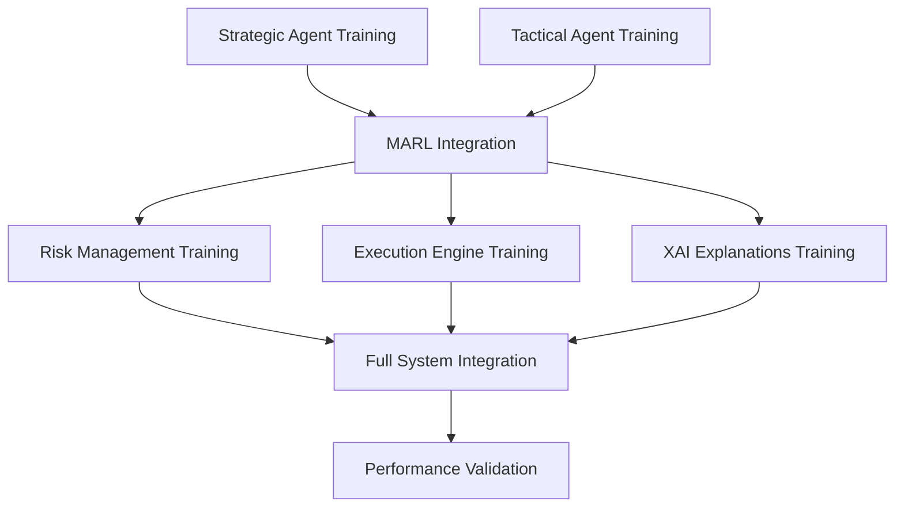

# TERMINAL COORDINATION MANUAL
## Comprehensive Guide for Dual Terminal MARL System Development

### Version: 1.0
### Last Updated: 2025-07-20

---

## EXECUTIVE SUMMARY

This manual provides comprehensive coordination protocols for two independent Claude Code terminals working in parallel on the GrandModel MARL system. The system divides responsibilities between Terminal 1 (Risk Management + Execution Engine + XAI) and Terminal 2 (Strategic + Tactical notebooks).

---

## 1. COORDINATION ARCHITECTURE

### 1.1 File-Based Communication System
```
/home/QuantNova/GrandModel/coordination/
├── terminal_progress/          # Real-time progress tracking
│   ├── terminal1_status.json   # Terminal 1 progress and status
│   ├── terminal2_status.json   # Terminal 2 progress and status
│   └── shared_milestones.json  # Cross-terminal milestone tracking
├── shared_configs/             # Unified configuration management
│   ├── marl_config.yaml        # MARL system configuration
│   ├── colab_config.yaml       # Google Colab Pro optimization
│   └── training_params.yaml    # Training hyperparameters
├── shared_checkpoints/         # Model checkpoint sharing
│   ├── strategic_models/       # Strategic agent checkpoints
│   ├── tactical_models/        # Tactical agent checkpoints
│   ├── risk_models/           # Risk management checkpoints
│   └── execution_models/       # Execution engine checkpoints
├── test_data/                  # Shared testing datasets
│   ├── minimalistic_datasets/  # Small validation datasets
│   ├── validation_data/        # Cross-validation datasets
│   └── integration_tests/      # Integration test data
└── documentation/              # Coordination documentation
    ├── progress_logs/          # Detailed progress logs
    ├── issue_tracking/         # Issue tracking and resolution
    └── shared_findings/        # Shared discoveries and insights
```

### 1.2 Terminal Responsibilities Matrix

| Component | Terminal 1 | Terminal 2 | Shared |
|-----------|------------|------------|---------|
| **Strategic MAPPO Training** | - | ✓ Primary | Integration Testing |
| **Tactical MAPPO Training** | - | ✓ Primary | Integration Testing |
| **Risk Management MAPPO** | ✓ Primary | - | Model Sharing |
| **Execution Engine MAPPO** | ✓ Primary | - | Model Sharing |
| **XAI Explanations MAPPO** | ✓ Primary | - | Model Sharing |
| **MARL Integration** | ✓ Support | ✓ Support | ✓ Joint |
| **Performance Validation** | ✓ Support | ✓ Support | ✓ Joint |
| **Colab Optimization** | ✓ Support | ✓ Support | ✓ Joint |

---

## 2. COMMUNICATION PROTOCOLS

### 2.1 Status Update Protocol

**Frequency**: Every 30 minutes during active development

**Terminal 1 Update Commands**:
```bash
# Update Terminal 1 status
python /home/QuantNova/GrandModel/coordination/scripts/update_terminal1_status.py

# Check Terminal 2 status
python /home/QuantNova/GrandModel/coordination/scripts/check_terminal2_status.py

# Sync shared milestones
python /home/QuantNova/GrandModel/coordination/scripts/sync_milestones.py
```

**Terminal 2 Update Commands**:
```bash
# Update Terminal 2 status
python /home/QuantNova/GrandModel/coordination/scripts/update_terminal2_status.py

# Check Terminal 1 status
python /home/QuantNova/GrandModel/coordination/scripts/check_terminal1_status.py

# Sync shared milestones
python /home/QuantNova/GrandModel/coordination/scripts/sync_milestones.py
```

### 2.2 Issue Reporting Protocol

**Immediate Issue Logging**:
```bash
# Report an issue
python /home/QuantNova/GrandModel/coordination/scripts/report_issue.py \
  --terminal "terminal_1" \
  --component "risk_management" \
  --severity "high" \
  --description "GPU memory overflow during training"

# Check for blocking issues
python /home/QuantNova/GrandModel/coordination/scripts/check_blocking_issues.py
```

### 2.3 Dependency Resolution Protocol

**Blocking Dependency Handling**:
- When a dependency is not ready, the dependent terminal waits
- Maximum wait time: 2 hours
- Automatic fallback to mock data if timeout exceeded
- Escalation to both terminals if critical path blocked

---

## 3. MILESTONE COORDINATION

### 3.1 Milestone Definitions

**Checkpoint 1: All Notebooks Execute Without Errors**
- **Target**: 2025-07-20 12:00:00 UTC
- **Success Criteria**:
  - All 5 notebooks run without compilation errors
  - All model architectures initialize properly
  - Training loops execute for at least 10 iterations
  - Checkpoint saving/loading functional

**Checkpoint 2: MARL Integration Functional**
- **Target**: 2025-07-20 18:00:00 UTC
- **Success Criteria**:
  - Multi-agent communication established
  - Centralized critic aggregates observations correctly
  - Action coordination protocols work
  - Reward sharing mechanisms operational

**Checkpoint 3: Colab Pro Optimization Complete**
- **Target**: 2025-07-21 00:00:00 UTC
- **Success Criteria**:
  - GPU memory usage under 15GB per notebook
  - Training time reduced by 50%+
  - Automatic checkpoint management
  - Google Drive integration functional

**Checkpoint 4: Full System Performance Validated**
- **Target**: 2025-07-21 12:00:00 UTC
- **Success Criteria**:
  - System latency under 100ms per decision
  - Risk management accuracy above 95%
  - Strategic decisions show positive alpha
  - XAI explanations are coherent

### 3.2 Milestone Validation Commands

```bash
# Validate Checkpoint 1
python /home/QuantNova/GrandModel/coordination/scripts/validate_checkpoint1.py

# Validate Checkpoint 2
python /home/QuantNova/GrandModel/coordination/scripts/validate_checkpoint2.py

# Validate Checkpoint 3
python /home/QuantNova/GrandModel/coordination/scripts/validate_checkpoint3.py

# Validate Checkpoint 4
python /home/QuantNova/GrandModel/coordination/scripts/validate_checkpoint4.py
```

---

## 4. DEPENDENCY MANAGEMENT

### 4.1 Dependency Graph



### 4.2 Critical Dependencies

**Terminal 2 → Terminal 1**:
- Strategic models for risk assessment
- Tactical signals for execution timing
- MARL foundation for integration

**Terminal 1 → Terminal 2**:
- Risk constraints for strategic planning
- Execution feedback for tactical refinement

### 4.3 Dependency Resolution Commands

```bash
# Wait for strategic models
python /home/QuantNova/GrandModel/coordination/scripts/wait_for_dependency.py \
  --dependency "strategic_models" \
  --timeout_hours 2

# Signal completion of risk models
python /home/QuantNova/GrandModel/coordination/scripts/signal_completion.py \
  --component "risk_models" \
  --terminal "terminal_1"

# Check all dependencies
python /home/QuantNova/GrandModel/coordination/scripts/check_all_dependencies.py
```

---

## 5. SHARED CONFIGURATION MANAGEMENT

### 5.1 Configuration Inheritance

**Priority Order**:
1. Local notebook configuration (highest priority)
2. Shared training parameters
3. Shared MARL configuration
4. Shared Colab configuration (lowest priority)

### 5.2 Configuration Update Protocol

```bash
# Update shared MARL config
python /home/QuantNova/GrandModel/coordination/scripts/update_marl_config.py \
  --parameter "learning_rate" \
  --value "3e-4" \
  --component "strategic_agent"

# Propagate config changes
python /home/QuantNova/GrandModel/coordination/scripts/propagate_config_changes.py

# Validate configuration consistency
python /home/QuantNova/GrandModel/coordination/scripts/validate_config_consistency.py
```

---

## 6. TESTING COORDINATION

### 6.1 Testing Hierarchy

```
1. Unit Testing (per terminal)
   ├── Individual notebook execution
   ├── Model architecture validation
   └── Training loop functionality

2. Integration Testing (cross-terminal)
   ├── Multi-agent communication
   ├── Checkpoint sharing
   └── Configuration consistency

3. Performance Testing (joint)
   ├── End-to-end latency
   ├── Resource utilization
   └── Accuracy benchmarks

4. Acceptance Testing (joint)
   ├── Business requirements
   ├── Production readiness
   └── Deployment validation
```

### 6.2 Testing Commands

```bash
# Run unit tests for Terminal 1
python /home/QuantNova/GrandModel/coordination/scripts/run_terminal1_tests.py

# Run integration tests
python /home/QuantNova/GrandModel/coordination/scripts/run_integration_tests.py

# Run performance validation
python /home/QuantNova/GrandModel/coordination/scripts/run_performance_tests.py

# Generate test report
python /home/QuantNova/GrandModel/coordination/scripts/generate_test_report.py
```

---

## 7. RESOURCE COORDINATION

### 7.1 Resource Allocation

**Terminal 1 Resources**:
- GPU Memory: 8GB
- CPU Cores: 4
- Disk Space: 50GB
- Priority: High

**Terminal 2 Resources**:
- GPU Memory: 7GB
- CPU Cores: 4
- Disk Space: 50GB
- Priority: High

### 7.2 Resource Monitoring

```bash
# Monitor resource usage
python /home/QuantNova/GrandModel/coordination/scripts/monitor_resources.py

# Check resource conflicts
python /home/QuantNova/GrandModel/coordination/scripts/check_resource_conflicts.py

# Optimize resource allocation
python /home/QuantNova/GrandModel/coordination/scripts/optimize_resources.py
```

---

## 8. ERROR HANDLING AND RECOVERY

### 8.1 Error Categories

**Category 1: Non-blocking Errors**
- Individual model training failures
- Configuration inconsistencies
- Resource contention

**Category 2: Blocking Errors**
- Critical dependency failures
- System-wide integration failures
- Data corruption

**Category 3: Terminal Communication Errors**
- Status update failures
- Checkpoint sharing failures
- Configuration synchronization failures

### 8.2 Recovery Procedures

```bash
# Automatic recovery attempt
python /home/QuantNova/GrandModel/coordination/scripts/auto_recovery.py \
  --error_type "training_failure" \
  --component "risk_management"

# Manual recovery initiation
python /home/QuantNova/GrandModel/coordination/scripts/manual_recovery.py \
  --checkpoint_path "/coordination/shared_checkpoints/risk_models/latest"

# System health check
python /home/QuantNova/GrandModel/coordination/scripts/system_health_check.py
```

---

## 9. SUCCESS CRITERIA AND VALIDATION

### 9.1 Success Metrics

**Technical Success Criteria**:
- All notebooks execute without errors: ✓/✗
- MARL integration functional: ✓/✗
- Performance targets met: ✓/✗
- Colab optimization complete: ✓/✗

**Business Success Criteria**:
- System latency < 100ms: ✓/✗
- Risk accuracy > 95%: ✓/✗
- Positive alpha generation: ✓/✗
- Production readiness: ✓/✗

### 9.2 Validation Commands

```bash
# Comprehensive system validation
python /home/QuantNova/GrandModel/coordination/scripts/comprehensive_validation.py

# Generate success report
python /home/QuantNova/GrandModel/coordination/scripts/generate_success_report.py

# Final certification
python /home/QuantNova/GrandModel/coordination/scripts/final_certification.py
```

---

## 10. TROUBLESHOOTING GUIDE

### 10.1 Common Issues

**Issue: Terminal Communication Failure**
```bash
# Diagnosis
ls -la /home/QuantNova/GrandModel/coordination/terminal_progress/
cat /home/QuantNova/GrandModel/coordination/terminal_progress/terminal1_status.json

# Solution
python /home/QuantNova/GrandModel/coordination/scripts/reset_communication.py
```

**Issue: Configuration Inconsistency**
```bash
# Diagnosis
python /home/QuantNova/GrandModel/coordination/scripts/diagnose_config_issues.py

# Solution
python /home/QuantNova/GrandModel/coordination/scripts/reset_shared_configs.py
```

**Issue: Dependency Timeout**
```bash
# Diagnosis
python /home/QuantNova/GrandModel/coordination/scripts/diagnose_dependencies.py

# Solution
python /home/QuantNova/GrandModel/coordination/scripts/resolve_dependency_timeout.py
```

### 10.2 Emergency Procedures

**Emergency Stop**:
```bash
python /home/QuantNova/GrandModel/coordination/scripts/emergency_stop.py
```

**System Reset**:
```bash
python /home/QuantNova/GrandModel/coordination/scripts/system_reset.py
```

**Recovery Mode**:
```bash
python /home/QuantNova/GrandModel/coordination/scripts/recovery_mode.py
```

---

## 11. CONCLUSION

This coordination manual ensures seamless collaboration between two independent terminals working on the complex MARL system. The file-based communication, shared configuration management, and comprehensive testing protocols provide a robust framework for parallel development.

For questions or issues not covered in this manual, refer to the issue tracking system in `/coordination/documentation/issue_tracking/` or escalate to the coordination scripts for automated resolution.