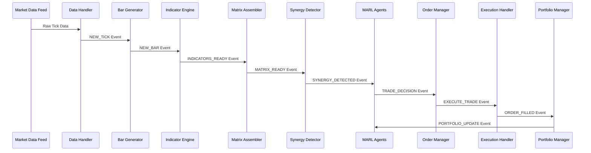

# Data Flow Architecture

## Overview

The GrandModel data flow architecture is designed for high-throughput, low-latency processing of financial market data. The system processes thousands of events per second while maintaining sub-millisecond latency for critical trading decisions. This document details the complete data flow from market data ingestion to trade execution.

## Table of Contents

- [Data Flow Overview](#data-flow-overview)
- [Ingestion Layer](#ingestion-layer)
- [Processing Pipeline](#processing-pipeline)
- [Analysis Pipeline](#analysis-pipeline)
- [Intelligence Pipeline](#intelligence-pipeline)
- [Execution Pipeline](#execution-pipeline)
- [Storage Architecture](#storage-architecture)
- [Caching Strategy](#caching-strategy)
- [Performance Optimization](#performance-optimization)

## Data Flow Overview

### High-Level Data Flow

```
External Market Data → Ingestion → Processing → Analysis → Intelligence → Execution
        ↓                ↓           ↓           ↓            ↓           ↓
   [Data Feeds]    [Validation]  [Indicators] [MARL Agents] [Orders]  [Broker]
        ↓                ↓           ↓           ↓            ↓           ↓
   [Normalization] [Bar Generation] [Matrices] [Decisions] [Portfolio] [Fills]
        ↓                ↓           ↓           ↓            ↓           ↓
     [Storage]     [Event Publishing] [Events] [Risk Mgmt] [Updates] [Feedback]
```

### Event-Driven Data Flow



## Ingestion Layer

### Market Data Sources

```python
class MarketDataSource:
    """Abstract base for market data sources"""
    
    def connect(self) -> bool:
        """Establish connection to data source"""
        
    def subscribe(self, symbols: List[str]) -> None:
        """Subscribe to symbol data feeds"""
        
    def on_tick(self, tick_data: TickData) -> None:
        """Handle incoming tick data"""
```

#### Supported Data Sources

1. **Rithmic Real-Time Data**
   - Ultra-low latency market data
   - Direct exchange connectivity
   - Tick-by-tick price updates
   - Order book depth data

2. **Interactive Brokers TWS API**
   - Real-time and historical data
   - Multiple asset classes
   - Market depth information
   - Fundamental data integration

3. **Historical Data Files**
   - CSV, Parquet, HDF5 formats
   - Backtesting data simulation
   - Custom data preprocessing
   - Multi-timeframe support

### Data Validation and Normalization

```python
class DataValidator:
    """Validate and normalize incoming market data"""
    
    def __init__(self, config: Dict):
        self.price_validators = self._setup_price_validators()
        self.volume_validators = self._setup_volume_validators()
        self.timestamp_validators = self._setup_timestamp_validators()
    
    def validate_tick(self, tick: TickData) -> Tuple[bool, List[str]]:
        """
        Comprehensive tick validation:
        - Price range validation
        - Volume sanity checks
        - Timestamp ordering
        - Symbol format validation
        - Market hours verification
        """
        errors = []
        
        # Price validation
        if not self._validate_price(tick.price, tick.symbol):
            errors.append(f"Invalid price: {tick.price}")
        
        # Volume validation
        if not self._validate_volume(tick.volume):
            errors.append(f"Invalid volume: {tick.volume}")
        
        # Timestamp validation
        if not self._validate_timestamp(tick.timestamp):
            errors.append(f"Invalid timestamp: {tick.timestamp}")
        
        return len(errors) == 0, errors
    
    def normalize_tick(self, tick: TickData) -> TickData:
        """
        Normalize tick data:
        - Standardize price precision
        - Convert timestamps to UTC
        - Normalize symbol format
        - Apply currency conversions
        """
        normalized_tick = TickData(
            symbol=self._normalize_symbol(tick.symbol),
            timestamp=self._normalize_timestamp(tick.timestamp),
            price=self._normalize_price(tick.price, tick.symbol),
            volume=int(tick.volume)
        )
        
        return normalized_tick
```

### Connection Management

```python
class ConnectionManager:
    """Manage connections to multiple data sources"""
    
    def __init__(self, config: Dict):
        self.connections = {}
        self.reconnect_attempts = {}
        self.max_reconnect_attempts = 10
        self.reconnect_delay = 5.0
    
    async def maintain_connections(self):
        """
        Continuously monitor and maintain connections:
        - Health check all connections
        - Automatic reconnection on failures
        - Connection failover between sources
        - Performance monitoring
        """
        while True:
            for source_name, connection in self.connections.items():
                if not connection.is_healthy():
                    await self._handle_connection_failure(source_name, connection)
            
            await asyncio.sleep(1.0)  # Check every second
    
    async def _handle_connection_failure(self, source_name: str, connection):
        """Handle connection failures with exponential backoff"""
        attempt = self.reconnect_attempts.get(source_name, 0)
        
        if attempt < self.max_reconnect_attempts:
            delay = self.reconnect_delay * (2 ** attempt)
            await asyncio.sleep(delay)
            
            if await connection.reconnect():
                self.reconnect_attempts[source_name] = 0
                logger.info(f"Reconnected to {source_name}")
            else:
                self.reconnect_attempts[source_name] = attempt + 1
                logger.warning(f"Reconnection attempt {attempt + 1} failed for {source_name}")
```

## Processing Pipeline

### Bar Generation

```python
class BarGenerator:
    """Generate OHLCV bars from tick data"""
    
    def __init__(self, config: Dict, event_bus: EventBus):
        self.event_bus = event_bus
        self.timeframes = config.get('timeframes', [5, 30])  # minutes
        self.current_bars = {}  # symbol -> timeframe -> current_bar
        self.bar_buffers = {}   # symbol -> timeframe -> completed_bars
    
    def on_new_tick(self, event: Event) -> None:
        """Process new tick data and generate bars"""
        tick_data = event.payload
        
        for timeframe in self.timeframes:
            self._update_bar(tick_data, timeframe)
    
    def _update_bar(self, tick: TickData, timeframe: int) -> None:
        """Update or create bar for specific timeframe"""
        bar_key = (tick.symbol, timeframe)
        bar_timestamp = self._get_bar_timestamp(tick.timestamp, timeframe)
        
        # Get or create current bar
        if bar_key not in self.current_bars:
            self.current_bars[bar_key] = self._create_new_bar(tick, bar_timestamp, timeframe)
        
        current_bar = self.current_bars[bar_key]
        
        # Check if we need to close current bar and start new one
        if bar_timestamp > current_bar.timestamp:
            self._close_bar(current_bar)
            self.current_bars[bar_key] = self._create_new_bar(tick, bar_timestamp, timeframe)
            current_bar = self.current_bars[bar_key]
        
        # Update current bar with tick data
        self._update_bar_with_tick(current_bar, tick)
    
    def _close_bar(self, bar: BarData) -> None:
        """Close completed bar and publish event"""
        # Store completed bar
        self._store_completed_bar(bar)
        
        # Publish bar completion event
        event_type = EventType.NEW_5MIN_BAR if bar.timeframe == 5 else EventType.NEW_30MIN_BAR
        event = self.event_bus.create_event(
            event_type,
            bar,
            "BarGenerator"
        )
        self.event_bus.publish(event)
    
    def _update_bar_with_tick(self, bar: BarData, tick: TickData) -> None:
        """Update bar OHLCV data with new tick"""
        # Update high/low
        bar.high = max(bar.high, tick.price)
        bar.low = min(bar.low, tick.price)
        
        # Update close price
        bar.close = tick.price
        
        # Update volume
        bar.volume += tick.volume
```

### Real-Time Processing Optimizations

```python
class HighFrequencyProcessor:
    """Optimized processing for high-frequency data"""
    
    def __init__(self, config: Dict):
        self.batch_size = config.get('batch_size', 100)
        self.batch_timeout = config.get('batch_timeout', 0.001)  # 1ms
        self.tick_buffer = []
        self.last_batch_time = time.time()
    
    def process_tick_batch(self, ticks: List[TickData]) -> None:
        """Process ticks in batches for better performance"""
        # Vectorized processing using NumPy
        prices = np.array([tick.price for tick in ticks])
        volumes = np.array([tick.volume for tick in ticks])
        timestamps = np.array([tick.timestamp.timestamp() for tick in ticks])
        
        # Batch calculations
        vwap = np.sum(prices * volumes) / np.sum(volumes)
        price_change = prices[-1] - prices[0]
        volume_total = np.sum(volumes)
        
        # Create batch processing result
        batch_result = {
            'vwap': vwap,
            'price_change': price_change,
            'volume_total': volume_total,
            'tick_count': len(ticks),
            'timespan': timestamps[-1] - timestamps[0]
        }
        
        return batch_result
    
    async def buffer_and_process(self, tick: TickData) -> None:
        """Buffer ticks and process in optimized batches"""
        self.tick_buffer.append(tick)
        
        current_time = time.time()
        
        # Process batch if buffer is full or timeout reached
        if (len(self.tick_buffer) >= self.batch_size or 
            current_time - self.last_batch_time >= self.batch_timeout):
            
            if self.tick_buffer:
                await self._process_buffered_ticks()
                self.tick_buffer.clear()
                self.last_batch_time = current_time
```

## Analysis Pipeline

### Indicator Engine

```python
class IndicatorEngine:
    """Calculate technical indicators from bar data"""
    
    def __init__(self, config: Dict, event_bus: EventBus):
        self.event_bus = event_bus
        self.indicators = self._initialize_indicators(config)
        self.data_buffers = {}  # symbol -> timeframe -> price_history
    
    def on_new_bar(self, event: Event) -> None:
        """Process new bar and calculate indicators"""
        bar_data = event.payload
        
        # Update price history buffer
        self._update_price_buffer(bar_data)
        
        # Calculate all indicators for this bar
        indicator_results = self._calculate_indicators(bar_data)
        
        # Publish indicator results
        self._publish_indicator_results(bar_data.symbol, bar_data.timeframe, indicator_results)
    
    def _calculate_indicators(self, bar: BarData) -> Dict[str, float]:
        """Calculate all configured indicators"""
        results = {}
        
        # Get price history for calculations
        price_history = self._get_price_history(bar.symbol, bar.timeframe)
        
        if len(price_history) < 50:  # Minimum history required
            return results
        
        # Calculate MLMI (Machine Learning Market Indicator)
        mlmi_result = self._calculate_mlmi(price_history)
        results.update(mlmi_result)
        
        # Calculate NWRQK (Neural Weighted Risk Qualification)
        nwrqk_result = self._calculate_nwrqk(price_history)
        results.update(nwrqk_result)
        
        # Calculate FVG (Fair Value Gap) for 5-minute bars
        if bar.timeframe == 5:
            fvg_result = self._calculate_fvg(price_history)
            results.update(fvg_result)
        
        # Calculate LVN (Low Volume Node) analysis
        lvn_result = self._calculate_lvn(price_history)
        results.update(lvn_result)
        
        # Calculate time-based features
        time_features = self._calculate_time_features(bar.timestamp)
        results.update(time_features)
        
        return results
    
    def _calculate_mlmi(self, price_history: List[BarData]) -> Dict[str, float]:
        """Calculate Machine Learning Market Indicator"""
        # Extract features for ML model
        features = self._extract_ml_features(price_history)
        
        # Run through trained ML model
        ml_output = self.mlmi_model.predict(features)
        
        return {
            'mlmi_value': float(ml_output[0]),
            'mlmi_signal': 1.0 if ml_output[0] > 0.5 else -1.0,
            'mlmi_confidence': abs(ml_output[0] - 0.5) * 2
        }
    
    def _calculate_nwrqk(self, price_history: List[BarData]) -> Dict[str, float]:
        """Calculate Neural Weighted Risk Qualification"""
        # Risk-adjusted momentum calculation
        returns = np.array([bar.close for bar in price_history[-20:]])
        returns = np.diff(returns) / returns[:-1]
        
        # Volatility-adjusted slope
        volatility = np.std(returns)
        slope = np.polyfit(range(len(returns)), returns, 1)[0]
        
        nwrqk_value = slope / (volatility + 1e-8)  # Risk-adjusted momentum
        
        return {
            'nwrqk_value': float(nwrqk_value),
            'nwrqk_slope': float(slope),
            'nwrqk_volatility': float(volatility)
        }
```

### Matrix Assembly

```python
class MatrixAssembler:
    """Assemble feature matrices for MARL agents"""
    
    def __init__(self, config: Dict):
        self.window_size = config['window_size']
        self.features = config['features']
        self.name = config.get('name', 'MatrixAssembler')
        self.feature_buffer = {}  # symbol -> feature_history
    
    def on_indicators_ready(self, event: Event) -> None:
        """Process new indicators and update feature matrices"""
        indicator_data = event.payload
        symbol = indicator_data['symbol']
        timeframe = indicator_data['timeframe']
        
        # Filter relevant indicators for this matrix
        relevant_features = self._filter_relevant_features(indicator_data)
        
        # Update feature buffer
        self._update_feature_buffer(symbol, relevant_features)
        
        # Check if we have enough data to create matrix
        if self._has_sufficient_data(symbol):
            feature_matrix = self._create_feature_matrix(symbol)
            self._publish_matrix_ready(symbol, timeframe, feature_matrix)
    
    def _create_feature_matrix(self, symbol: str) -> np.ndarray:
        """Create feature matrix from historical data"""
        feature_history = self.feature_buffer[symbol]
        
        # Get last window_size observations
        recent_features = feature_history[-self.window_size:]
        
        # Create matrix (window_size x num_features)
        matrix = np.array([[getattr(obs, feature, 0.0) for feature in self.features] 
                          for obs in recent_features])
        
        # Normalize features
        matrix = self._normalize_matrix(matrix)
        
        return matrix
    
    def _normalize_matrix(self, matrix: np.ndarray) -> np.ndarray:
        """Normalize feature matrix for MARL input"""
        # Z-score normalization
        mean = np.mean(matrix, axis=0)
        std = np.std(matrix, axis=0)
        
        # Avoid division by zero
        std = np.where(std == 0, 1, std)
        
        normalized = (matrix - mean) / std
        
        # Clip extreme values
        normalized = np.clip(normalized, -3, 3)
        
        return normalized
```

## Intelligence Pipeline

### MARL Agent Processing

```python
class MARLInferenceEngine:
    """High-performance MARL agent inference"""
    
    def __init__(self, agents: Dict[str, Any]):
        self.agents = agents
        self.inference_cache = {}
        self.batch_processor = BatchInferenceProcessor()
    
    async def process_strategic_decision(self, market_state: Dict) -> Dict:
        """Process strategic decision with all agents"""
        # Prepare observations for all agents
        observations = self._prepare_agent_observations(market_state)
        
        # Batch inference for efficiency
        agent_actions = await self._batch_agent_inference(observations)
        
        # Coordinate agent decisions
        coordinated_decision = self._coordinate_agent_decisions(agent_actions)
        
        return coordinated_decision
    
    async def _batch_agent_inference(self, observations: Dict) -> Dict:
        """Perform batched inference across all agents"""
        inference_tasks = []
        
        for agent_name, observation in observations.items():
            task = asyncio.create_task(
                self._agent_inference(agent_name, observation)
            )
            inference_tasks.append((agent_name, task))
        
        # Wait for all inferences to complete
        results = {}
        for agent_name, task in inference_tasks:
            try:
                action = await asyncio.wait_for(task, timeout=0.1)  # 100ms timeout
                results[agent_name] = action
            except asyncio.TimeoutError:
                logger.warning(f"Agent {agent_name} inference timeout")
                results[agent_name] = self._get_default_action(agent_name)
        
        return results
    
    async def _agent_inference(self, agent_name: str, observation: np.ndarray) -> Any:
        """Perform inference for single agent"""
        agent = self.agents[agent_name]
        
        # Check cache for recent identical observations
        obs_hash = hash(observation.tobytes())
        if obs_hash in self.inference_cache:
            return self.inference_cache[obs_hash]
        
        # Perform inference
        with torch.no_grad():
            action = agent.select_action(observation, training=False)
        
        # Cache result (with size limit)
        if len(self.inference_cache) < 1000:
            self.inference_cache[obs_hash] = action
        
        return action
```

### Risk Assessment Integration

```python
class RealTimeRiskAssessment:
    """Real-time risk assessment for trading decisions"""
    
    def __init__(self, config: Dict):
        self.var_calculator = VaRCalculator(config)
        self.kelly_calculator = KellyCalculator(config)
        self.correlation_tracker = CorrelationTracker(config)
        self.position_limits = config['position_limits']
    
    def assess_trade_risk(self, trade_proposal: Dict, current_portfolio: Dict) -> Dict:
        """Comprehensive risk assessment for proposed trade"""
        assessment = {
            'approved': False,
            'risk_score': 0.0,
            'recommended_size': 0.0,
            'risk_factors': [],
            'warnings': []
        }
        
        # Calculate position-level risk
        position_risk = self._calculate_position_risk(trade_proposal)
        
        # Calculate portfolio-level risk
        portfolio_risk = self._calculate_portfolio_risk(trade_proposal, current_portfolio)
        
        # Calculate correlation risk
        correlation_risk = self._calculate_correlation_risk(trade_proposal, current_portfolio)
        
        # Kelly Criterion position sizing
        kelly_size = self.kelly_calculator.calculate_optimal_size(trade_proposal)
        
        # Overall risk assessment
        total_risk = max(position_risk, portfolio_risk, correlation_risk)
        
        # Decision logic
        if total_risk < 0.7 and kelly_size > 0:
            assessment['approved'] = True
            assessment['recommended_size'] = min(kelly_size, self.position_limits['max_position'])
        
        assessment['risk_score'] = total_risk
        
        return assessment
```

## Execution Pipeline

### Order Management

```python
class OrderManagementSystem:
    """High-performance order management and routing"""
    
    def __init__(self, config: Dict, event_bus: EventBus):
        self.event_bus = event_bus
        self.order_router = OrderRouter(config)
        self.risk_monitor = RealTimeRiskMonitor(config)
        self.execution_tracker = ExecutionTracker()
        
    def process_trade_decision(self, event: Event) -> None:
        """Process MARL trade decision and execute orders"""
        trade_decision = event.payload
        
        # Pre-execution risk check
        risk_check = self.risk_monitor.validate_trade(trade_decision)
        if not risk_check['approved']:
            self._reject_trade(trade_decision, risk_check['reason'])
            return
        
        # Create order from trade decision
        order = self._create_order(trade_decision, risk_check['recommended_size'])
        
        # Route order to appropriate venue
        execution_plan = self.order_router.create_execution_plan(order)
        
        # Execute order
        self._execute_order(order, execution_plan)
    
    def _execute_order(self, order: Order, execution_plan: ExecutionPlan) -> None:
        """Execute order according to execution plan"""
        if execution_plan.strategy == 'MARKET':
            self._execute_market_order(order)
        elif execution_plan.strategy == 'LIMIT':
            self._execute_limit_order(order, execution_plan.limit_price)
        elif execution_plan.strategy == 'TWAP':
            self._execute_twap_order(order, execution_plan.duration)
        elif execution_plan.strategy == 'ICEBERG':
            self._execute_iceberg_order(order, execution_plan.display_size)
    
    async def _execute_market_order(self, order: Order) -> None:
        """Execute market order with optimal routing"""
        # Get current market data
        market_data = await self._get_current_market_data(order.symbol)
        
        # Calculate expected execution price
        expected_price = self._calculate_expected_execution_price(order, market_data)
        
        # Submit order to broker
        execution_result = await self.broker.submit_market_order(order)
        
        # Track execution
        self.execution_tracker.record_execution(order, execution_result)
        
        # Publish execution event
        self._publish_execution_event(order, execution_result)
```

### Portfolio Management

```python
class PortfolioManager:
    """Real-time portfolio management and position tracking"""
    
    def __init__(self, config: Dict, event_bus: EventBus):
        self.event_bus = event_bus
        self.positions = {}  # symbol -> position
        self.cash_balance = config['initial_capital']
        self.performance_tracker = PerformanceTracker()
        
    def on_order_filled(self, event: Event) -> None:
        """Update portfolio on order fills"""
        fill_data = event.payload
        
        # Update position
        self._update_position(fill_data)
        
        # Update cash balance
        self._update_cash_balance(fill_data)
        
        # Calculate unrealized P&L
        unrealized_pnl = self._calculate_unrealized_pnl()
        
        # Update performance metrics
        self.performance_tracker.update_metrics(self.positions, unrealized_pnl)
        
        # Publish portfolio update
        self._publish_portfolio_update()
    
    def _update_position(self, fill_data: Dict) -> None:
        """Update position data with new fill"""
        symbol = fill_data['symbol']
        quantity = fill_data['quantity']
        price = fill_data['price']
        
        if symbol not in self.positions:
            self.positions[symbol] = Position(symbol=symbol)
        
        position = self.positions[symbol]
        
        # Update position size and average price
        if position.quantity == 0:
            # New position
            position.quantity = quantity
            position.average_price = price
        else:
            # Existing position
            if (position.quantity > 0 and quantity > 0) or (position.quantity < 0 and quantity < 0):
                # Adding to position
                total_cost = position.quantity * position.average_price + quantity * price
                position.quantity += quantity
                position.average_price = total_cost / position.quantity
            else:
                # Reducing position or reversing
                position.quantity += quantity
                # Keep same average price for partial close
                if position.quantity == 0:
                    position.average_price = 0.0
        
        # Update position timestamps
        position.last_update = datetime.now()
```

## Storage Architecture

### Multi-Tier Storage Strategy

```python
class StorageManager:
    """Manage multi-tier data storage strategy"""
    
    def __init__(self, config: Dict):
        # Hot storage (Redis) - frequently accessed data
        self.redis_client = redis.Redis(
            host=config['redis']['host'],
            port=config['redis']['port'],
            db=config['redis']['db']
        )
        
        # Warm storage (PostgreSQL) - recent operational data
        self.postgres_engine = create_engine(config['postgres']['url'])
        
        # Cold storage (TimescaleDB) - historical time series
        self.timescale_engine = create_engine(config['timescale']['url'])
        
        # Archive storage (S3) - long-term historical data
        self.s3_client = boto3.client('s3')
        
    def store_tick_data(self, tick: TickData) -> None:
        """Store tick data across appropriate storage tiers"""
        # Hot storage - last 1000 ticks per symbol
        self._store_hot_tick_data(tick)
        
        # Warm storage - last 24 hours
        if self._should_store_warm(tick):
            self._store_warm_tick_data(tick)
        
        # Cold storage - everything for analysis
        if self._should_store_cold(tick):
            self._store_cold_tick_data(tick)
    
    def _store_hot_tick_data(self, tick: TickData) -> None:
        """Store in Redis for immediate access"""
        key = f"ticks:{tick.symbol}"
        tick_json = json.dumps({
            'timestamp': tick.timestamp.isoformat(),
            'price': tick.price,
            'volume': tick.volume
        })
        
        # Use Redis list with size limit
        pipe = self.redis_client.pipeline()
        pipe.lpush(key, tick_json)
        pipe.ltrim(key, 0, 999)  # Keep only last 1000 ticks
        pipe.expire(key, 3600)   # Expire after 1 hour
        pipe.execute()
```

### Time Series Optimization

```sql
-- TimescaleDB hypertable for tick data
CREATE TABLE tick_data (
    timestamp TIMESTAMPTZ NOT NULL,
    symbol TEXT NOT NULL,
    price DECIMAL(10,4) NOT NULL,
    volume INTEGER NOT NULL,
    exchange TEXT
);

-- Create hypertable partitioned by time
SELECT create_hypertable('tick_data', 'timestamp', chunk_time_interval => INTERVAL '1 hour');

-- Create indexes for common queries
CREATE INDEX idx_tick_data_symbol_time ON tick_data (symbol, timestamp DESC);
CREATE INDEX idx_tick_data_price ON tick_data (timestamp, price) WHERE volume > 100;

-- Compression policy for older data
SELECT add_compression_policy('tick_data', INTERVAL '1 day');

-- Data retention policy
SELECT add_retention_policy('tick_data', INTERVAL '1 year');
```

## Caching Strategy

### Multi-Level Caching

```python
class CacheManager:
    """Intelligent multi-level caching system"""
    
    def __init__(self, config: Dict):
        # L1 Cache - In-memory (fastest)
        self.l1_cache = {}
        self.l1_max_size = config.get('l1_max_size', 10000)
        
        # L2 Cache - Redis (fast, persistent)
        self.l2_cache = redis.Redis(
            host=config['redis']['host'],
            port=config['redis']['port'],
            db=1  # Separate DB for cache
        )
        
        # Cache statistics
        self.cache_stats = {
            'l1_hits': 0,
            'l2_hits': 0,
            'misses': 0
        }
    
    def get(self, key: str) -> Optional[Any]:
        """Get value from cache with fallback strategy"""
        # Try L1 cache first
        if key in self.l1_cache:
            self.cache_stats['l1_hits'] += 1
            return self.l1_cache[key]
        
        # Try L2 cache (Redis)
        l2_value = self.l2_cache.get(key)
        if l2_value:
            self.cache_stats['l2_hits'] += 1
            # Promote to L1 cache
            self._set_l1(key, pickle.loads(l2_value))
            return pickle.loads(l2_value)
        
        # Cache miss
        self.cache_stats['misses'] += 1
        return None
    
    def set(self, key: str, value: Any, ttl: int = 3600) -> None:
        """Set value in appropriate cache levels"""
        # Set in L1 cache
        self._set_l1(key, value)
        
        # Set in L2 cache with TTL
        self.l2_cache.setex(key, ttl, pickle.dumps(value))
    
    def _set_l1(self, key: str, value: Any) -> None:
        """Set value in L1 cache with LRU eviction"""
        if len(self.l1_cache) >= self.l1_max_size:
            # Remove oldest item (simple FIFO for demo)
            oldest_key = next(iter(self.l1_cache))
            del self.l1_cache[oldest_key]
        
        self.l1_cache[key] = value
```

## Performance Optimization

### Latency Optimization Techniques

```python
class LatencyOptimizer:
    """System-wide latency optimization"""
    
    def __init__(self, config: Dict):
        self.config = config
        self.setup_cpu_affinity()
        self.setup_memory_optimization()
        self.setup_network_optimization()
    
    def setup_cpu_affinity(self) -> None:
        """Pin critical processes to specific CPU cores"""
        import psutil
        
        # Pin data handler to cores 0-1
        data_handler_cores = [0, 1]
        # Pin MARL inference to cores 2-3
        marl_cores = [2, 3]
        # Pin order execution to cores 4-5
        execution_cores = [4, 5]
        
        # Set CPU affinity for current process
        p = psutil.Process()
        p.cpu_affinity(data_handler_cores + marl_cores + execution_cores)
    
    def setup_memory_optimization(self) -> None:
        """Optimize memory allocation and garbage collection"""
        import gc
        
        # Tune garbage collection
        gc.set_threshold(700, 10, 10)
        
        # Pre-allocate memory pools for common objects
        self.tick_pool = ObjectPool(TickData, size=10000)
        self.bar_pool = ObjectPool(BarData, size=1000)
        self.event_pool = ObjectPool(Event, size=5000)
    
    def optimize_data_structures(self) -> None:
        """Use optimized data structures for performance"""
        # Use NumPy arrays for numerical calculations
        # Use deque for FIFO operations
        # Use heapq for priority queues
        # Use bisect for sorted insertions
        pass
```

### Throughput Optimization

```python
class ThroughputOptimizer:
    """Optimize system throughput for high-frequency data"""
    
    def __init__(self, config: Dict):
        self.batch_size = config.get('batch_size', 100)
        self.worker_threads = config.get('worker_threads', 4)
        self.queue_size = config.get('queue_size', 10000)
        
        # Setup worker thread pool
        self.thread_pool = ThreadPoolExecutor(max_workers=self.worker_threads)
        
        # Setup high-performance queues
        self.tick_queue = queue.Queue(maxsize=self.queue_size)
        self.processing_queue = queue.Queue(maxsize=self.queue_size)
    
    async def process_high_frequency_stream(self) -> None:
        """Process high-frequency data stream with optimizations"""
        
        # Batch processing for efficiency
        batch = []
        last_process_time = time.time()
        
        while True:
            try:
                # Get tick with timeout
                tick = self.tick_queue.get(timeout=0.001)
                batch.append(tick)
                
                # Process batch when full or timeout reached
                current_time = time.time()
                if (len(batch) >= self.batch_size or 
                    current_time - last_process_time >= 0.005):  # 5ms timeout
                    
                    # Submit batch for processing
                    future = self.thread_pool.submit(self._process_tick_batch, batch)
                    
                    # Clear batch and reset timer
                    batch = []
                    last_process_time = current_time
                    
            except queue.Empty:
                # No ticks available, continue
                continue
    
    def _process_tick_batch(self, ticks: List[TickData]) -> None:
        """Process batch of ticks efficiently"""
        # Vectorized operations using NumPy
        prices = np.array([tick.price for tick in ticks])
        volumes = np.array([tick.volume for tick in ticks])
        
        # Batch calculations
        vwap = np.sum(prices * volumes) / np.sum(volumes)
        price_change = prices[-1] - prices[0]
        volatility = np.std(prices)
        
        # Create batch processing result
        result = {
            'vwap': vwap,
            'price_change': price_change,
            'volatility': volatility,
            'tick_count': len(ticks)
        }
        
        # Queue result for further processing
        self.processing_queue.put(result)
```

This comprehensive data flow architecture ensures efficient, low-latency processing of market data while maintaining high throughput and reliability. The design supports real-time trading requirements while providing the flexibility to handle various data sources and processing patterns.

## Related Documentation

- [System Overview](system_overview.md)
- [Component Design](component_design.md)
- [API Documentation](../api/)
- [Performance Guide](../guides/performance_guide.md)
- [Deployment Guide](../guides/deployment_guide.md)