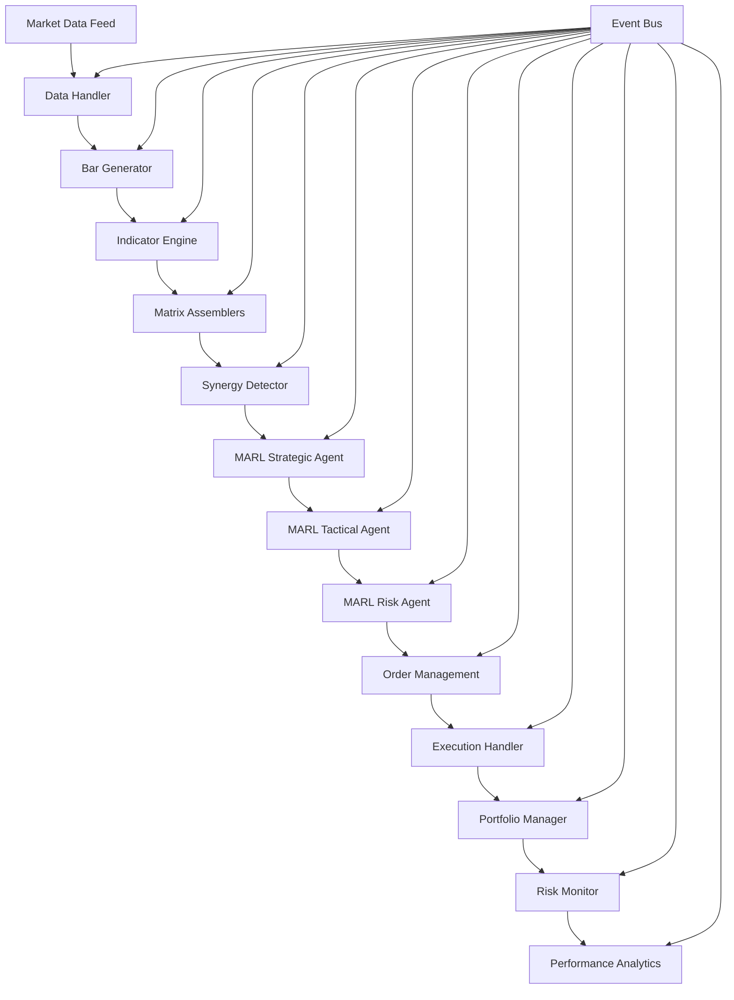

# GrandModel System Architecture Overview

## Overview

GrandModel is a sophisticated Multi-Agent Reinforcement Learning (MARL) trading system designed for high-frequency algorithmic trading. The architecture is built on event-driven principles, emphasizing modularity, scalability, and real-time performance while maintaining robust risk management and compliance capabilities.

## Table of Contents

- [Architectural Principles](#architectural-principles)
- [System Architecture](#system-architecture)
- [Component Architecture](#component-architecture)
- [Data Flow Architecture](#data-flow-architecture)
- [Event-Driven Architecture](#event-driven-architecture)
- [MARL Intelligence Layer](#marl-intelligence-layer)
- [Security Architecture](#security-architecture)
- [Deployment Architecture](#deployment-architecture)
- [Performance Considerations](#performance-considerations)

## Architectural Principles

### Core Design Principles

1. **Event-Driven Architecture**: All communication between components flows through a centralized event bus, ensuring loose coupling and high scalability.

2. **Microservices-Ready**: Components are designed as independent services that can be deployed separately while maintaining system coherence.

3. **Real-Time Processing**: Sub-millisecond latency for critical trading decisions with optimized data pipelines.

4. **Fault Tolerance**: Graceful degradation and recovery mechanisms to maintain trading operations during component failures.

5. **Horizontal Scalability**: Architecture supports scaling individual components based on load requirements.

6. **Security-First**: Built-in security at every layer with encryption, authentication, and authorization.

### Design Patterns

- **Observer Pattern**: Event subscriptions and notifications
- **Strategy Pattern**: Pluggable trading algorithms and risk models
- **Factory Pattern**: Dynamic component instantiation
- **Repository Pattern**: Data access abstraction
- **Circuit Breaker**: Fault tolerance for external services
- **Command Query Responsibility Segregation (CQRS)**: Separate read/write operations

## System Architecture

### High-Level Architecture

```
┌─────────────────────────────────────────────────────────────────────────────┐
│                            GrandModel Trading System                        │
├─────────────────────────────────────────────────────────────────────────────┤
│                              Presentation Layer                             │
│  ┌─────────────────┐  ┌─────────────────┐  ┌─────────────────┐           │
│  │   Web UI        │  │   REST API      │  │   WebSocket     │           │
│  │   (React)       │  │   (FastAPI)     │  │   Real-time     │           │
│  └─────────────────┘  └─────────────────┘  └─────────────────┘           │
├─────────────────────────────────────────────────────────────────────────────┤
│                            Application Layer                                │
│  ┌─────────────────────────────────────────────────────────────────────────┐ │
│  │                        AlgoSpace Kernel                                │ │
│  │  ┌─────────────────┐  ┌─────────────────┐  ┌─────────────────┐       │ │
│  │  │   Component     │  │   Event Bus     │  │   Configuration │       │ │
│  │  │   Manager       │  │   Dispatcher    │  │   Manager       │       │ │
│  │  └─────────────────┘  └─────────────────┘  └─────────────────┘       │ │
│  └─────────────────────────────────────────────────────────────────────────┘ │
├─────────────────────────────────────────────────────────────────────────────┤
│                              Business Layer                                 │
│  ┌─────────────────┐  ┌─────────────────┐  ┌─────────────────┐           │
│  │   Data Pipeline │  │  Analysis Layer │  │ Intelligence    │           │
│  │                 │  │                 │  │ Layer (MARL)    │           │
│  │  • Data Handler │  │  • Indicators   │  │                 │           │
│  │  • Bar Generator│  │  • Matrix Assembler│ • Strategic    │           │
│  │  • Preprocessor │  │  • Synergy Det. │  │   Agent         │           │
│  └─────────────────┘  └─────────────────┘  │ • Tactical      │           │
│                                             │   Agent         │           │
│  ┌─────────────────┐  ┌─────────────────┐  │ • Risk Agent    │           │
│  │  Execution Layer│  │   Risk Layer    │  └─────────────────┘           │
│  │                 │  │                 │                                │
│  │  • Order Mgmt   │  │  • Kelly Calc   │                                │
│  │  • Execution    │  │  • VAR Calc     │                                │
│  │  • Portfolio    │  │  • Correlation  │                                │
│  └─────────────────┘  └─────────────────┘                                │
├─────────────────────────────────────────────────────────────────────────────┤
│                               Data Layer                                    │
│  ┌─────────────────┐  ┌─────────────────┐  ┌─────────────────┐           │
│  │   PostgreSQL    │  │     Redis       │  │   TimescaleDB   │           │
│  │   (Relational)  │  │   (Cache)       │  │  (Time Series)  │           │
│  └─────────────────┘  └─────────────────┘  └─────────────────┘           │
├─────────────────────────────────────────────────────────────────────────────┤
│                           Infrastructure Layer                             │
│  ┌─────────────────┐  ┌─────────────────┐  ┌─────────────────┐           │
│  │   Monitoring    │  │   Logging       │  │   Security      │           │
│  │   (Prometheus)  │  │   (ELK Stack)   │  │   (Auth/SSL)    │           │
│  └─────────────────┘  └─────────────────┘  └─────────────────┘           │
└─────────────────────────────────────────────────────────────────────────────┘
```

### Component Interaction Flow



## Component Architecture

### Kernel Architecture

The AlgoSpace Kernel serves as the central orchestrator:

```python
class AlgoSpaceKernel:
    """
    Central system orchestrator responsible for:
    - Component lifecycle management
    - Event bus coordination
    - Configuration management
    - Error handling and recovery
    - System monitoring
    """
    
    def __init__(self, config_path: str):
        self.config = load_config(config_path)
        self.event_bus = EventBus()
        self.components = {}
        self.running = False
    
    def initialize(self) -> None:
        """Initialize all components in dependency order"""
        self._instantiate_components()
        self._wire_events()
        self._initialize_components()
    
    def run(self) -> None:
        """Start the main system loop"""
        self._start_data_streams()
        self.event_bus.dispatch_forever()
```

### Data Pipeline Architecture

```
┌─────────────────────────────────────────────────────────────────┐
│                        Data Pipeline                            │
├─────────────────────────────────────────────────────────────────┤
│  Raw Market Data Sources                                        │
│  ┌─────────────────┐  ┌─────────────────┐  ┌─────────────────┐ │
│  │    Rithmic      │  │ Interactive     │  │   Historical    │ │
│  │    Real-time    │  │   Brokers       │  │   Data Files    │ │
│  └─────────────────┘  └─────────────────┘  └─────────────────┘ │
│           │                      │                      │      │
│           └──────────────────────┼──────────────────────┘      │
│                                  │                             │
│  ┌─────────────────────────────────────────────────────────────┐ │
│  │                  Data Handler                               │ │
│  │  • Tick data processing                                     │ │
│  │  • Data validation and cleaning                             │ │
│  │  • Real-time data normalization                             │ │
│  │  • Connection management                                    │ │
│  └─────────────────────────────────────────────────────────────┘ │
│                                  │                             │
│  ┌─────────────────────────────────────────────────────────────┐ │
│  │                 Bar Generator                               │ │
│  │  • 5-minute tactical bars                                   │ │
│  │  • 30-minute strategic bars                                 │ │
│  │  • Volume-based aggregation                                 │ │
│  │  • Time-based aggregation                                   │ │
│  └─────────────────────────────────────────────────────────────┘ │
│                                  │                             │
│  ┌─────────────────────────────────────────────────────────────┐ │
│  │              Indicator Engine                               │ │
│  │  • MLMI (Machine Learning Market Indicator)                 │ │
│  │  • NWRQK (Neural Weighted Risk Qualification)               │ │
│  │  • FVG (Fair Value Gap) Detection                           │ │
│  │  • LVN (Low Volume Node) Analysis                           │ │
│  │  • MMD (Maximum Mean Discrepancy) Features                  │ │
│  └─────────────────────────────────────────────────────────────┘ │
└─────────────────────────────────────────────────────────────────┘
```

### Analysis Layer Architecture

```
┌─────────────────────────────────────────────────────────────────┐
│                      Analysis Layer                             │
├─────────────────────────────────────────────────────────────────┤
│  ┌─────────────────────────────────────────────────────────────┐ │
│  │                Matrix Assemblers                            │ │
│  │                                                             │ │
│  │  ┌─────────────────┐  ┌─────────────────┐  ┌─────────────┐ │ │
│  │  │   30min Matrix  │  │   5min Matrix   │  │   Regime    │ │ │
│  │  │   (Strategic)   │  │   (Tactical)    │  │   Matrix    │ │ │
│  │  │                 │  │                 │  │             │ │ │
│  │  │ • 48 bars       │  │ • 60 bars       │  │ • 96 bars   │ │ │
│  │  │ • 13 features   │  │ • 7 features    │  │ • 4 regimes │ │ │
│  │  │ • MLMI/NWRQK    │  │ • FVG/LVN       │  │ • MMD       │ │ │
│  │  └─────────────────┘  └─────────────────┘  └─────────────┘ │ │
│  └─────────────────────────────────────────────────────────────┘ │
│                                  │                             │
│  ┌─────────────────────────────────────────────────────────────┐ │
│  │                 Synergy Detector                            │ │
│  │  • Pattern Recognition (TYPE_1 to TYPE_4)                   │ │
│  │  • Multi-timeframe Correlation                              │ │
│  │  • Signal Confidence Scoring                                │ │
│  │  • Market Regime Classification                             │ │
│  └─────────────────────────────────────────────────────────────┘ │
└─────────────────────────────────────────────────────────────────┘
```

## Data Flow Architecture

### Real-Time Data Flow

```
Market Data → Data Handler → Bar Generator → Indicator Engine
     ↓             ↓              ↓               ↓
Event Bus ← Event Bus ← Event Bus ← Event Bus
     ↓             ↓              ↓               ↓
Matrix Assemblers ← Synergy Detector ← MARL Agents
     ↓                     ↓              ↓
Order Management ← Trade Decision ← Risk Assessment
     ↓
Execution Handler → Broker API → Trade Confirmation
     ↓
Portfolio Update → Performance Analytics → Reporting
```

### Data Processing Pipeline

1. **Ingestion Phase**
   - Raw tick data reception
   - Data validation and sanitization
   - Connection monitoring and recovery

2. **Aggregation Phase**
   - Time-based bar generation
   - Volume-weighted calculations
   - Multi-timeframe synchronization

3. **Analysis Phase**
   - Technical indicator calculation
   - Feature matrix assembly
   - Pattern recognition

4. **Intelligence Phase**
   - MARL agent decision making
   - Multi-agent coordination
   - Risk assessment

5. **Execution Phase**
   - Order routing and management
   - Trade execution confirmation
   - Portfolio state updates

## Event-Driven Architecture

### Event Bus Implementation

```python
class EventBus:
    """
    Central event dispatch system supporting:
    - Type-safe event routing
    - Asynchronous event processing
    - Error isolation between subscribers
    - High-throughput event handling
    """
    
    def __init__(self):
        self._subscribers: Dict[EventType, List[Callable]] = {}
        self._event_queue: asyncio.Queue = asyncio.Queue()
    
    def subscribe(self, event_type: EventType, callback: Callable) -> None:
        """Subscribe to specific event types"""
    
    def publish(self, event: Event) -> None:
        """Publish events to all subscribers"""
    
    async def dispatch_forever(self) -> None:
        """Main event processing loop"""
```

### Event Flow Patterns

#### Data Processing Events
```
NEW_TICK → NEW_5MIN_BAR → INDICATORS_READY → SYNERGY_DETECTED
    ↓           ↓               ↓                ↓
[DataHandler] [BarGen] [IndicatorEngine] [SynergyDetector]
```

#### Trading Decision Events
```
SYNERGY_DETECTED → STRATEGIC_DECISION → EXECUTE_TRADE → ORDER_FILLED
       ↓                ↓                  ↓             ↓
[SynergyDetector] [MARLAgents] [OrderManager] [ExecutionHandler]
```

#### Risk Management Events
```
POSITION_UPDATE → RISK_ASSESSMENT → RISK_BREACH → EMERGENCY_STOP
      ↓               ↓               ↓            ↓
[Portfolio] [RiskCalculator] [RiskMonitor] [EmergencyHandler]
```

## MARL Intelligence Layer

### Multi-Agent Architecture

```
┌─────────────────────────────────────────────────────────────────┐
│                    MARL Intelligence Layer                      │
├─────────────────────────────────────────────────────────────────┤
│  ┌─────────────────────────────────────────────────────────────┐ │
│  │                  Coordination Layer                         │ │
│  │  ┌───────────────────────────────────────────────────────┐ │ │
│  │  │              Strategic MARL Component                 │ │ │
│  │  │  • Agent coordination                                │ │ │
│  │  │  • Shared environment state                          │ │ │
│  │  │  • Reward distribution                               │ │ │
│  │  │  • Experience sharing                                │ │ │
│  │  └───────────────────────────────────────────────────────┘ │ │
│  └─────────────────────────────────────────────────────────────┘ │
│                                  │                             │
│  ┌─────────────────┐  ┌─────────────────┐  ┌─────────────────┐ │
│  │  Strategic      │  │   Tactical      │  │    Risk         │ │
│  │  Agent          │  │   Agent         │  │    Agent        │ │
│  │                 │  │                 │  │                 │ │
│  │ • 30min bars    │  │ • 5min bars     │  │ • Portfolio     │ │
│  │ • Direction     │  │ • Entry timing  │  │   metrics       │ │
│  │ • Position size │  │ • Stop levels   │  │ • Risk limits   │ │
│  │ • Conviction    │  │ • Scaling       │  │ • Emergency     │ │
│  │                 │  │                 │  │   stops         │ │
│  └─────────────────┘  └─────────────────┘  └─────────────────┘ │
│          │                     │                     │         │
│  ┌─────────────────────────────────────────────────────────────┐ │
│  │                    Shared Environment                       │ │
│  │  • Market state representation                              │ │
│  │  • Multi-agent observation space                            │ │
│  │  • Coordinated action space                                 │ │
│  │  • Collective reward function                               │ │
│  └─────────────────────────────────────────────────────────────┘ │
└─────────────────────────────────────────────────────────────────┘
```

### Agent Interaction Patterns

#### Collaborative Decision Making
```python
def coordinate_agents(self, market_state: Dict) -> Dict:
    """
    Agent coordination process:
    1. Distribute market observations to all agents
    2. Collect individual agent actions
    3. Negotiate consensus through communication
    4. Resolve conflicts with predefined hierarchy
    5. Execute coordinated action
    """
    
    # Individual agent decisions
    strategic_action = self.strategic_agent.select_action(market_state)
    tactical_action = self.tactical_agent.select_action(market_state)
    risk_action = self.risk_agent.select_action(market_state)
    
    # Coordination mechanism
    coordinated_decision = self.coordinate_decisions(
        strategic_action, tactical_action, risk_action
    )
    
    return coordinated_decision
```

### Learning and Adaptation

```python
class MARLLearningSystem:
    """
    Multi-agent learning coordination:
    - Centralized training, decentralized execution
    - Experience sharing between agents
    - Curriculum learning progression
    - Performance-based model updates
    """
    
    def update_agents(self, episode_experiences: List[Dict]) -> None:
        """
        Update all agents with shared experiences:
        1. Individual agent model updates
        2. Cross-agent experience sharing
        3. Coordination mechanism improvement
        4. Collective performance evaluation
        """
```

## Security Architecture

### Multi-Layer Security

```
┌─────────────────────────────────────────────────────────────────┐
│                        Security Layers                          │
├─────────────────────────────────────────────────────────────────┤
│  ┌─────────────────────────────────────────────────────────────┐ │
│  │              Application Security                           │ │
│  │  • JWT-based authentication                                 │ │
│  │  • Role-based access control (RBAC)                         │ │
│  │  • API rate limiting                                        │ │
│  │  • Input validation and sanitization                        │ │
│  └─────────────────────────────────────────────────────────────┘ │
│  ┌─────────────────────────────────────────────────────────────┐ │
│  │                Network Security                             │ │
│  │  • TLS 1.3 encryption                                       │ │
│  │  • VPN/private network access                               │ │
│  │  • Firewall rules and network segmentation                  │ │
│  │  • DDoS protection                                          │ │
│  └─────────────────────────────────────────────────────────────┘ │
│  ┌─────────────────────────────────────────────────────────────┐ │
│  │                  Data Security                              │ │
│  │  • Encryption at rest (AES-256)                             │ │
│  │  • Encryption in transit (TLS)                              │ │
│  │  • Key management (HashiCorp Vault)                         │ │
│  │  • Database access controls                                 │ │
│  └─────────────────────────────────────────────────────────────┘ │
│  ┌─────────────────────────────────────────────────────────────┐ │
│  │             Infrastructure Security                         │ │
│  │  • Container security scanning                              │ │
│  │  • Runtime security monitoring                              │ │
│  │  • Secrets management                                       │ │
│  │  • Audit logging and compliance                             │ │
│  └─────────────────────────────────────────────────────────────┘ │
└─────────────────────────────────────────────────────────────────┘
```

### Authentication and Authorization

```python
class SecurityManager:
    """
    Centralized security management:
    - Multi-factor authentication
    - Token-based authorization
    - Permission-based access control
    - Security audit logging
    """
    
    def authenticate_user(self, credentials: Dict) -> Optional[UserSession]:
        """Authenticate user with multi-factor support"""
    
    def authorize_action(self, user: User, resource: str, action: str) -> bool:
        """Authorize specific actions on resources"""
    
    def audit_log(self, user: User, action: str, resource: str) -> None:
        """Log security-relevant actions"""
```

## Deployment Architecture

### Production Deployment Topology

```
┌─────────────────────────────────────────────────────────────────┐
│                     Production Environment                      │
├─────────────────────────────────────────────────────────────────┤
│  ┌─────────────────────────────────────────────────────────────┐ │
│  │                  Load Balancer Layer                        │ │
│  │  ┌─────────────────┐  ┌─────────────────┐                  │ │
│  │  │    HAProxy      │  │      Nginx      │                  │ │
│  │  │   (Primary)     │  │   (Secondary)   │                  │ │
│  │  └─────────────────┘  └─────────────────┘                  │ │
│  └─────────────────────────────────────────────────────────────┘ │
│                                  │                             │
│  ┌─────────────────────────────────────────────────────────────┐ │
│  │                Application Cluster                          │ │
│  │  ┌─────────────────┐  ┌─────────────────┐  ┌─────────────┐ │ │
│  │  │  GrandModel     │  │  GrandModel     │  │ GrandModel  │ │ │
│  │  │  Instance 1     │  │  Instance 2     │  │ Instance 3  │ │ │
│  │  │  (Primary)      │  │  (Secondary)    │  │ (Tertiary)  │ │ │
│  │  └─────────────────┘  └─────────────────┘  └─────────────┘ │ │
│  └─────────────────────────────────────────────────────────────┘ │
│                                  │                             │
│  ┌─────────────────────────────────────────────────────────────┐ │
│  │                  Database Cluster                           │ │
│  │  ┌─────────────────┐  ┌─────────────────┐  ┌─────────────┐ │ │
│  │  │   PostgreSQL    │  │     Redis       │  │ TimescaleDB │ │ │
│  │  │   (Master)      │  │   (Cluster)     │  │  (Cluster)  │ │ │
│  │  └─────────────────┘  └─────────────────┘  └─────────────┘ │ │
│  │  ┌─────────────────┐  ┌─────────────────┐                  │ │
│  │  │   PostgreSQL    │  │     Redis       │                  │ │
│  │  │   (Replica)     │  │   (Replica)     │                  │ │
│  │  └─────────────────┘  └─────────────────┘                  │ │
│  └─────────────────────────────────────────────────────────────┘ │
└─────────────────────────────────────────────────────────────────┘
```

### Kubernetes Architecture

```yaml
# Kubernetes deployment architecture
apiVersion: v1
kind: Namespace
metadata:
  name: grandmodel-production

---
# Application deployment with multiple replicas
apiVersion: apps/v1
kind: Deployment
metadata:
  name: grandmodel-app
spec:
  replicas: 3
  strategy:
    type: RollingUpdate
    rollingUpdate:
      maxSurge: 1
      maxUnavailable: 0
  template:
    spec:
      affinity:
        podAntiAffinity:
          requiredDuringSchedulingIgnoredDuringExecution:
          - labelSelector:
              matchLabels:
                app: grandmodel
            topologyKey: kubernetes.io/hostname
```

## Performance Considerations

### Latency Optimization

1. **CPU Affinity**: Pin critical processes to specific CPU cores
2. **Memory Management**: Use huge pages and optimized garbage collection
3. **Network Optimization**: Kernel bypass with DPDK for ultra-low latency
4. **Cache Optimization**: Multi-level caching with Redis and in-memory stores

### Scalability Design

1. **Horizontal Scaling**: Stateless application design enables easy scaling
2. **Database Sharding**: Partition large datasets across multiple databases
3. **Event Bus Clustering**: Distribute event processing across multiple nodes
4. **MARL Agent Distribution**: Distribute agent inference across GPU clusters

### Resource Management

```python
class PerformanceManager:
    """
    System performance optimization:
    - CPU and memory monitoring
    - Automatic scaling decisions
    - Resource allocation optimization
    - Performance bottleneck detection
    """
    
    def optimize_system_performance(self) -> None:
        """
        Continuous performance optimization:
        1. Monitor resource utilization
        2. Identify performance bottlenecks
        3. Automatically adjust resource allocation
        4. Scale components based on demand
        """
```

### Monitoring and Observability

```
┌─────────────────────────────────────────────────────────────────┐
│                  Monitoring Architecture                        │
├─────────────────────────────────────────────────────────────────┤
│  ┌─────────────────────────────────────────────────────────────┐ │
│  │                 Metrics Collection                          │ │
│  │  • Prometheus (System metrics)                              │ │
│  │  • Custom application metrics                               │ │
│  │  • Trading performance metrics                              │ │
│  │  • MARL agent performance metrics                           │ │
│  └─────────────────────────────────────────────────────────────┘ │
│                                  │                             │
│  ┌─────────────────────────────────────────────────────────────┐ │
│  │                Log Aggregation                              │ │
│  │  • ELK Stack (Elasticsearch, Logstash, Kibana)              │ │
│  │  • Structured logging with correlation IDs                  │ │
│  │  • Real-time log analysis and alerting                      │ │
│  └─────────────────────────────────────────────────────────────┘ │
│                                  │                             │
│  ┌─────────────────────────────────────────────────────────────┐ │
│  │              Visualization and Alerting                     │ │
│  │  • Grafana dashboards                                       │ │
│  │  • Real-time trading dashboards                             │ │
│  │  • PagerDuty integration for critical alerts                │ │
│  │  • Slack notifications for system events                    │ │
│  └─────────────────────────────────────────────────────────────┘ │
└─────────────────────────────────────────────────────────────────┘
```

This comprehensive system architecture provides the foundation for a robust, scalable, and performant MARL trading system. The design emphasizes modularity, real-time performance, and operational excellence while maintaining the flexibility to adapt to changing market conditions and requirements.

## Related Documentation

- [Data Flow Architecture](data_flow.md)
- [Component Design](component_design.md)
- [Security Architecture](security.md)
- [API Documentation](../api/)
- [Deployment Guide](../guides/deployment_guide.md)