# Grand Model Complete System Flow Diagram

```mermaid
graph TB
    %% Market Data Input
    MarketData[Market Data Stream<br/>Live Price Feed] --> DataHandler[Data Handler<br/>WebSocket Processing]
    DataHandler --> BarGen[Bar Generator<br/>5m & 30m Bars]
    
    %% Technical Analysis Pipeline
    BarGen --> IndicatorEngine[Indicator Engine<br/>MLMI, NWRQK, FVG, LVN, MMD]
    IndicatorEngine --> MatrixAssembler30m[30m Matrix Assembler<br/>48×13 Strategic Matrix]
    IndicatorEngine --> MatrixAssembler5m[5m Matrix Assembler<br/>60×7 Tactical Matrix]
    IndicatorEngine --> RegimeMatrix[Regime Matrix<br/>96×4 Market Regime]
    
    %% Event Bus Core
    EventBus[Event Bus<br/>Central Communication Hub] --> SynergyDetector[Synergy Detector<br/>Opportunity Scanner]
    
    %% MARL Intelligence Layer
    subgraph MARL[" MARL Intelligence Layer "]
        %% Strategic MARL (30-minute)
        subgraph Strategic[" Strategic MARL (30min) "]
            StructureAnalyzer[Structure Analyzer<br/>40% Weight<br/>Long-term Trends]
            MLMIAgent[MLMI Strategic Agent<br/>Momentum Analysis]
            NWRQKAgent[NWRQK Strategic Agent<br/>Quality Assessment]
            RegimeAgent[Regime Detection Agent<br/>Market State]
        end
        
        %% Tactical MARL (5-minute)
        subgraph Tactical[" Tactical MARL (5min) "]
            MidFreqArb[Mid-Frequency Arbitrageur<br/>30% Weight<br/>Cross-timeframe]
            ShortTermTact[Short-Term Tactician<br/>30% Weight<br/>High-freq Timing]
            FVGAgent[FVG Agent<br/>Gap Analysis]
            MomentumAgent[Momentum Agent<br/>Price Momentum]
            EntryAgent[Entry Agent<br/>Timing Optimization]
        end
        
        %% Risk Management MARL
        subgraph RiskMARL[" Risk Management MARL "]
            VaRCalc[VaR Calculator<br/>Multiple Methods]
            CorrTracker[Correlation Tracker<br/>EWMA λ=0.94]
            KellyCalc[Kelly Calculator<br/>Position Sizing]
            EmergencyProtocol[Emergency Protocols<br/>Auto Risk Reduction]
        end
        
        %% Execution MARL
        subgraph ExecMARL[" Execution MARL "]
            RoutingAgent[Routing Agent<br/>Smart Order Routing]
            TimingAgent[Timing Agent<br/>Execution Timing]
            PosizingAgent[Position Sizing Agent<br/>Optimal Size]
            RiskMgmtAgent[Risk Management Agent<br/>Trade Validation]
        end
    end
    
    %% Main Core Decision Engine
    subgraph MainCore[" Main MARL Core Engine "]
        %% Embedders
        StructureEmb[Structure Embedder<br/>48×8 → Features]
        TacticalEmb[Tactical Embedder<br/>60×7 → Features]
        RegimeEmb[Regime Embedder<br/>96×4 → Features]
        LVNEmb[LVN Embedder<br/>Volume Analysis]
        
        %% Shared Policy
        SharedPolicy[Shared Policy Network<br/>Neural Network]
        
        %% Two-Gate System
        Gate1[Gate 1: MC Dropout<br/>Consensus Evaluation]
        Gate2[Gate 2: Decision Gate<br/>Risk Integration]
        
        %% Decision Output
        TradeDecision[Trade Decision<br/>Action + Confidence]
    end
    
    %% Risk Integration
    RiskAssessment[Risk Assessment<br/>Multi-factor Analysis]
    RiskProposal[Risk Proposal<br/>Position Limits]
    
    %% Order Management
    OrderManager[Order Management<br/>Smart Order Routing]
    ExecutionHandler[Execution Handler<br/>Broker Integration]
    
    %% Broker Integration
    AlpacaBroker[Alpaca Broker<br/>Commission-Free Trading]
    IBBroker[Interactive Brokers<br/>Professional Trading]
    
    %% Monitoring & Analytics
    subgraph Monitoring[" Monitoring & Analytics "]
        Dashboard[Real-time Dashboard<br/>WebSocket Updates]
        Grafana[Grafana Dashboards<br/>System Monitoring]
        Prometheus[Prometheus Metrics<br/>Performance Tracking]
        AlertSystem[Alert System<br/>Automated Notifications]
    end
    
    %% Data Persistence
    PostgreSQL[PostgreSQL<br/>Historical Data]
    Redis[Redis<br/>Real-time Cache]
    
    %% System Flow Connections
    %% Data Flow
    MatrixAssembler30m --> StructureAnalyzer
    MatrixAssembler30m --> MLMIAgent
    MatrixAssembler30m --> NWRQKAgent
    MatrixAssembler5m --> MidFreqArb
    MatrixAssembler5m --> ShortTermTact
    MatrixAssembler5m --> FVGAgent
    RegimeMatrix --> RegimeAgent
    
    %% Synergy Detection
    SynergyDetector --> MainCore
    
    %% Embedder Connections
    StructureAnalyzer --> StructureEmb
    MidFreqArb --> TacticalEmb
    ShortTermTact --> TacticalEmb
    RegimeAgent --> RegimeEmb
    IndicatorEngine --> LVNEmb
    
    %% Decision Flow
    StructureEmb --> SharedPolicy
    TacticalEmb --> SharedPolicy
    RegimeEmb --> SharedPolicy
    LVNEmb --> SharedPolicy
    
    SharedPolicy --> Gate1
    Gate1 --> Gate2
    
    %% Risk Integration
    VaRCalc --> RiskAssessment
    CorrTracker --> RiskAssessment
    KellyCalc --> RiskProposal
    RiskProposal --> Gate2
    
    Gate2 --> TradeDecision
    
    %% Execution Flow
    TradeDecision --> OrderManager
    OrderManager --> ExecutionHandler
    ExecutionHandler --> AlpacaBroker
    ExecutionHandler --> IBBroker
    
    %% Monitoring Connections
    EventBus --> Dashboard
    EventBus --> Prometheus
    Prometheus --> Grafana
    Grafana --> AlertSystem
    
    %% Data Persistence
    EventBus --> PostgreSQL
    EventBus --> Redis
    
    %% Emergency Protocols
    EmergencyProtocol --> OrderManager
    EmergencyProtocol --> AlertSystem
    
    %% Redis Real-time
    Redis --> Tactical
    Redis --> Dashboard
    
    %% Styling
    classDef dataFlow fill:#e3f2fd,stroke:#1565c0,stroke-width:2px
    classDef marlAgent fill:#fff3e0,stroke:#ff8f00,stroke-width:2px
    classDef riskComponent fill:#ffebee,stroke:#d32f2f,stroke-width:2px
    classDef coreEngine fill:#e8f5e8,stroke:#2e7d32,stroke-width:2px
    classDef execution fill:#f3e5f5,stroke:#7b1fa2,stroke-width:2px
    classDef monitoring fill:#fafafa,stroke:#424242,stroke-width:2px
    
    class MarketData,DataHandler,BarGen,IndicatorEngine dataFlow
    class StructureAnalyzer,MidFreqArb,ShortTermTact,MLMIAgent,NWRQKAgent marlAgent
    class VaRCalc,CorrTracker,EmergencyProtocol,RiskAssessment riskComponent
    class MainCore,SharedPolicy,Gate1,Gate2,TradeDecision coreEngine
    class OrderManager,ExecutionHandler,AlpacaBroker,IBBroker execution
    class Dashboard,Grafana,Prometheus,AlertSystem monitoring
```

## Grand Model System Architecture Overview

### 1. **Data Processing Pipeline**
- **Market Data Stream**: Real-time price feeds via WebSocket
- **Bar Generation**: Creates 5-minute and 30-minute OHLCV bars
- **Technical Indicators**: MLMI, NWRQK, FVG, LVN, MMD calculations
- **Matrix Assembly**: 
  - 30-minute: 48×13 strategic matrix (24 hours)
  - 5-minute: 60×7 tactical matrix (5 hours)
  - Regime: 96×4 market regime matrix (8 hours)

### 2. **Multi-Agent Reinforcement Learning (MARL) Intelligence**

#### **Strategic MARL (30-minute timeframe)**
- **Structure Analyzer** (40% weight): Long-term market structure analysis
- **MLMI Strategic Agent**: Momentum and trend analysis
- **NWRQK Strategic Agent**: Quality and strength assessment
- **Regime Detection Agent**: Market state identification

#### **Tactical MARL (5-minute timeframe)**
- **Mid-Frequency Arbitrageur** (30% weight): Cross-timeframe inefficiencies
- **Short-Term Tactician** (30% weight): High-frequency timing optimization
- **FVG Agent**: Fair Value Gap analysis
- **Momentum Agent**: Price momentum tracking
- **Entry Agent**: Optimal entry timing

#### **Risk Management MARL**
- **VaR Calculator**: Parametric, Historical, Monte Carlo methods
- **Correlation Tracker**: EWMA-based correlation monitoring
- **Kelly Calculator**: Optimal position sizing
- **Emergency Protocols**: Automated risk reduction

#### **Execution MARL**
- **Routing Agent**: Smart order routing optimization
- **Timing Agent**: Execution timing algorithms
- **Position Sizing Agent**: Real-time position optimization
- **Risk Management Agent**: Trade validation and limits

### 3. **Main MARL Core Engine**

#### **Embedders**
- **Structure Embedder**: Processes 48×8 strategic matrix
- **Tactical Embedder**: Processes 60×7 tactical matrix
- **Regime Embedder**: Processes 96×4 regime matrix
- **LVN Embedder**: Volume analysis and liquidity assessment

#### **Two-Gate Decision System**
- **Gate 1**: MC Dropout consensus evaluation across agents
- **Gate 2**: Final decision integration with risk proposals
- **Shared Policy**: Neural network for unified decision making

### 4. **Risk Integration Layer**
- **Multi-factor Risk Assessment**: Combines VaR, correlation, and regime analysis
- **Risk Proposals**: Position limits and risk-adjusted recommendations
- **Emergency Protocols**: Automated leverage reduction and position closure

### 5. **Execution & Order Management**
- **Smart Order Routing**: Optimal broker selection and routing
- **Execution Algorithms**: TWAP, VWAP, market impact minimization
- **Broker Integration**: Alpaca (commission-free) and Interactive Brokers

### 6. **Monitoring & Analytics**
- **Real-time Dashboard**: WebSocket-based live monitoring
- **Grafana Dashboards**: System performance visualization
- **Prometheus Metrics**: Comprehensive performance tracking
- **Alert System**: Automated notifications and emergency alerts

### 7. **Data Architecture**
- **PostgreSQL**: Historical data storage and analytics
- **Redis**: Real-time caching and high-frequency data
- **Event Bus**: Central communication hub for all components

## Key System Characteristics

### **Performance Targets**
- **Latency**: Sub-millisecond decision making
- **Throughput**: >1000 decisions per second
- **Accuracy**: 95%+ prediction accuracy
- **Uptime**: 99.9% system availability

### **Risk Management**
- **Multi-layer Risk Controls**: Pre-trade, real-time, post-trade
- **Automated Safeguards**: Correlation shock detection, leverage limits
- **Emergency Protocols**: Automatic position closure and trading halt
- **Compliance**: Full audit trail and regulatory reporting

### **Scalability**
- **Horizontal Scaling**: Kubernetes-based deployment
- **Load Balancing**: Distributed agent processing
- **Memory Management**: Efficient caching and garbage collection
- **Resource Optimization**: Dynamic resource allocation

### **Intelligence Features**
- **Adaptive Learning**: Continuous model improvement
- **Regime Detection**: Market state identification and adaptation
- **Cross-timeframe Analysis**: Multi-resolution decision making
- **Ensemble Methods**: Weighted agent consensus

This Grand Model system represents a comprehensive, production-ready algorithmic trading platform that combines advanced machine learning, rigorous risk management, and high-performance execution capabilities.