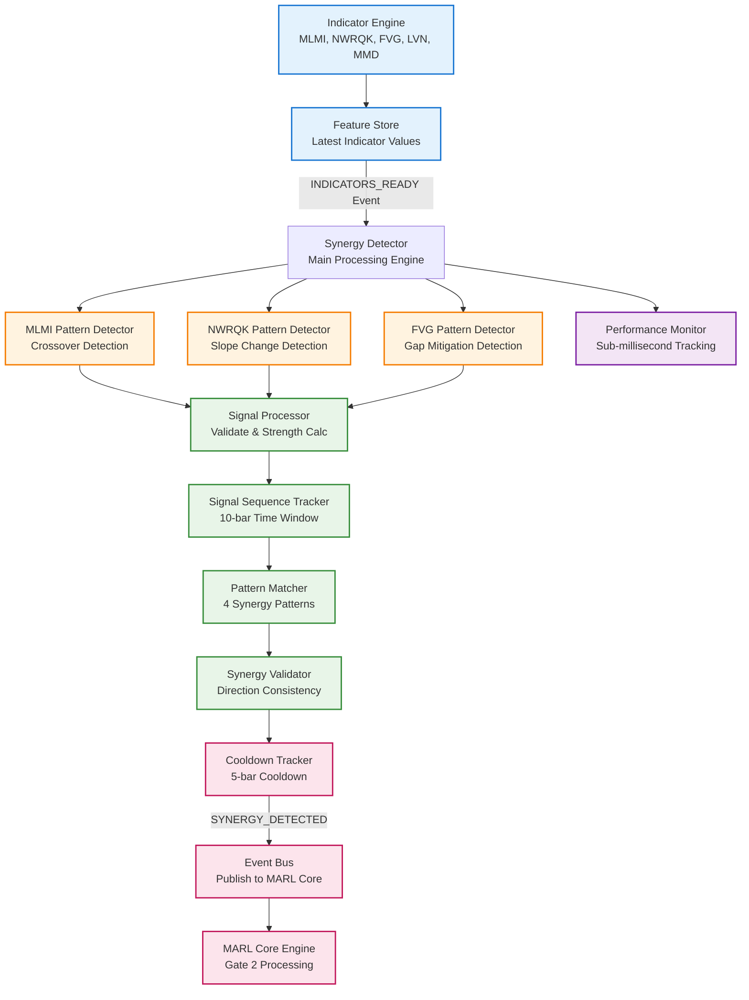

# Synergy Detection System - Detailed Breakdown

## Overview

The Synergy Detection System is a **hard-coded, rule-based pattern recognition engine** that serves as **Gate 1** in the Grand Model's two-gate MARL system. It monitors technical indicators and detects when they converge into one of four predefined synergy patterns, providing high-confidence trading signals with **<1ms processing time**.

## System Architecture



## Core Components Deep Dive

### 1. Main Synergy Detector (`detector.py`)

**Purpose**: Central orchestrator that coordinates pattern detection and manages the complete synergy detection workflow.

**Key Features**:
- Subscribes to `INDICATORS_READY` events from the Feature Store
- Coordinates 3 pattern detectors (MLMI, NWRQK, FVG)
- Manages signal sequencing and pattern matching
- Enforces cooldown periods between detections
- Guarantees <1ms processing time per event

**Process Flow**:
```python
async def _handle_indicators_ready(event):
    1. Extract features from event payload
    2. Detect individual signals from all pattern detectors
    3. Add signals to sequence tracker (validates time windows)
    4. Check if sequence forms valid synergy pattern
    5. Validate cooldown status
    6. Emit SYNERGY_DETECTED event if valid
    7. Update performance metrics
```

### 2. Pattern Detectors (`patterns.py`)

#### MLMI Pattern Detector
**Detection Logic**: Crossover events with signal strength validation
- **Trigger**: `mlmi_signal != 0` (crossover above/below neutral line)
- **Threshold**: Deviation from neutral (50) must exceed configured threshold
- **Strength Calculation**: `min(deviation_from_neutral / 50, 1.0)`

```python
# Example MLMI Detection
mlmi_value = 72.5  # Above neutral (50)
deviation = abs(72.5 - 50) = 22.5
required_deviation = 0.5 * 50 = 25.0
if 22.5 < 25.0: return None  # Below threshold
```

#### NWRQK Pattern Detector
**Detection Logic**: Direction changes based on slope magnitude
- **Trigger**: `nwrqk_signal != 0` (direction change detected)
- **Threshold**: Slope magnitude must exceed configured threshold
- **Strength Calculation**: `min(slope_magnitude / 2.0, 1.0)`

```python
# Example NWRQK Detection
nwrqk_slope = 0.45
slope_magnitude = abs(0.45) = 0.45
threshold = 0.3
if 0.45 > 0.3: # Valid signal
    strength = min(0.45 / 2.0, 1.0) = 0.225
```

#### FVG Pattern Detector
**Detection Logic**: Fair Value Gap mitigation events
- **Trigger**: `fvg_mitigation_signal == True`
- **Validation**: Gap size must exceed minimum percentage threshold
- **Strength Calculation**: `min(gap_size_pct / 0.01, 1.0)` (normalized to 1% max)

```python
# Example FVG Detection
gap_size = 15.0  # Points
current_price = 4500.0
gap_size_pct = 15.0 / 4500.0 = 0.0033 (0.33%)
min_size = 0.001 (0.1%)
if 0.0033 > 0.001: # Valid signal
    strength = min(0.0033 / 0.01, 1.0) = 0.33
```

### 3. Signal Sequence Tracker (`sequence.py`)

**Purpose**: Manages the ordering and timing of signals to form valid synergy patterns.

**Key Constraints**:
- **Time Window**: 10 bars (50 minutes) maximum for pattern completion
- **Direction Consistency**: All signals must have same direction (bullish/bearish)
- **No Duplicates**: Each signal type can only appear once in sequence
- **Automatic Reset**: Sequence resets on violation of any constraint

**State Management**:
```python
@dataclass
class SignalSequence:
    signals: List[Signal] = []
    start_time: Optional[datetime] = None
    time_window_bars: int = 10
    bar_duration_minutes: int = 5
    
    def add_signal(self, signal: Signal) -> bool:
        # Validation checks:
        # 1. Time window not exceeded
        # 2. Direction consistency maintained
        # 3. Signal type not duplicated
        # 4. Auto-reset on violations
```

### 4. Pattern Matching Engine

**Four Synergy Patterns**:
The system detects exactly 4 predefined patterns based on signal order:

```python
SYNERGY_PATTERNS = {
    ('mlmi', 'nwrqk', 'fvg'): 'TYPE_1',  # Momentum → Slope → Gap
    ('mlmi', 'fvg', 'nwrqk'): 'TYPE_2',  # Momentum → Gap → Slope  
    ('nwrqk', 'fvg', 'mlmi'): 'TYPE_3',  # Slope → Gap → Momentum
    ('nwrqk', 'mlmi', 'fvg'): 'TYPE_4'   # Slope → Momentum → Gap
}
```

**Pattern Significance**:
- **TYPE_1**: Strong momentum confirmed by slope change, validated by gap fill
- **TYPE_2**: Momentum setup with gap opportunity, slope confirmation
- **TYPE_3**: Slope change with gap support, momentum validation
- **TYPE_4**: Slope change with momentum, gap mitigation opportunity

### 5. Cooldown Management

**Purpose**: Prevents signal spam and ensures quality by enforcing 5-bar cooldown periods.

**Cooldown Logic**:
- **Duration**: 5 bars (25 minutes) after each synergy detection
- **Tracking**: Monitors time elapsed since last synergy emission
- **Enforcement**: Blocks new synergy emissions during cooldown
- **Logging**: Tracks rejected synergies during cooldown for analysis

```python
class CooldownTracker:
    def can_emit(self) -> bool:
        if self.last_synergy_time is None:
            return True
        
        bars_elapsed = self._calculate_bars_elapsed()
        return bars_elapsed >= self.cooldown_bars
```

## Detection Process Flow

### Step-by-Step Detection Flow

1. **Event Reception**
   ```python
   INDICATORS_READY event received
   → Extract features from Feature Store
   → Add timestamp to features
   ```

2. **Signal Detection**
   ```python
   For each detector (MLMI, NWRQK, FVG):
   → Check if pattern conditions met
   → Validate signal strength vs threshold
   → Create Signal object with metadata
   ```

3. **Sequence Processing**
   ```python
   For each detected signal:
   → Validate time window (10 bars max)
   → Check direction consistency
   → Verify no duplicate signal types
   → Add to sequence or reset if invalid
   ```

4. **Pattern Matching**
   ```python
   If sequence has 3 signals:
   → Get signal type tuple
   → Check against SYNERGY_PATTERNS dict
   → Create SynergyPattern if match found
   ```

5. **Validation & Cooldown**
   ```python
   If valid synergy detected:
   → Check cooldown status (5 bars)
   → If can emit: publish SYNERGY_DETECTED event
   → Start new cooldown period
   → Reset sequence for next pattern
   ```

## Signal Validation Rules

### Time Window Validation
- **Maximum Duration**: 10 bars (50 minutes)
- **Calculation**: `(current_time - start_time) / bar_duration`
- **Action on Violation**: Reset sequence, start new with current signal

### Direction Consistency
- **Rule**: All signals must have same direction (+1 or -1)
- **Validation**: Compare each new signal direction with first signal
- **Action on Violation**: Reset sequence, start new with current signal

### Signal Type Uniqueness
- **Rule**: Each signal type (mlmi, nwrqk, fvg) can only appear once
- **Validation**: Check existing signals for duplicate types
- **Action on Duplicate**: Ignore signal, continue with current sequence

## Performance Characteristics

### Processing Speed
- **Target**: <1ms per event processing
- **Measurement**: Per-event timing with performance counters
- **Optimization**: Hard-coded rules, minimal computations, efficient data structures

### Memory Usage
- **Signal Storage**: Circular buffer with configurable size
- **Sequence Tracking**: Lightweight state objects
- **Pattern History**: Limited retention for performance analysis

### Monitoring Metrics
```python
performance_metrics = {
    'events_processed': 0,
    'synergies_detected': 0,
    'signals_detected': 0,
    'avg_processing_time_ms': 0.0,
    'max_processing_time_ms': 0.0,
    'patterns_by_type': {
        'TYPE_1': 0,
        'TYPE_2': 0,
        'TYPE_3': 0,
        'TYPE_4': 0
    }
}
```

## Integration with MARL System

### Event Flow
1. **Input**: `INDICATORS_READY` from Feature Store
2. **Processing**: Synergy detection and validation
3. **Output**: `SYNERGY_DETECTED` to MARL Core
4. **Consumption**: Main Core processes for Gate 2 decision

### Event Payload Structure
```python
{
    'synergy_type': 'TYPE_1',           # Pattern type detected
    'direction': 1,                     # 1 (long) or -1 (short)
    'confidence': 1.0,                  # Always 1.0 for hard-coded rules
    'timestamp': datetime.now(),        # Completion time
    'signal_sequence': [                # Ordered signal details
        {
            'type': 'mlmi',
            'value': 65.2,
            'strength': 0.8,
            'timestamp': datetime.now()
        },
        # ... more signals
    ],
    'market_context': {                 # Current market state
        'current_price': 4532.50,
        'volatility': 0.045,
        'volume_profile': {...},
        'nearest_lvn': {...}
    },
    'metadata': {                       # Additional context
        'bars_to_complete': 3,
        'signal_strengths': {...}
    }
}
```

## Configuration Options

### Detection Thresholds
```yaml
synergy_detector:
  mlmi_threshold: 0.5        # MLMI deviation threshold (0-1)
  nwrqk_threshold: 0.3       # NWRQK slope threshold
  fvg_min_size: 0.001        # FVG minimum gap size (0.1%)
  
  time_window_bars: 10       # Max bars for pattern completion
  cooldown_bars: 5           # Cooldown period between detections
```

### Performance Settings
```yaml
performance:
  max_processing_time_ms: 1.0    # Alert threshold
  enable_detailed_logging: false # Performance vs verbosity
  metrics_update_frequency: 100  # Update interval
```

## Error Handling & Edge Cases

### Invalid Signal Sequences
- **Timeout**: Sequence exceeds 10-bar window → Reset and start new
- **Direction Conflict**: New signal has opposite direction → Reset and start new
- **Duplicate Type**: Same signal type detected twice → Ignore new signal

### Performance Degradation
- **Slow Processing**: >1ms processing time → Log warning, investigate
- **Memory Pressure**: Too many stored signals → Implement circular buffer
- **Event Flood**: Too many rapid events → Implement rate limiting

### Market Conditions
- **Low Volatility**: Signals may be weaker → Dynamic threshold adjustment
- **High Volatility**: Signals may be noisy → Enhanced validation
- **Market Gaps**: Time-based validation issues → Robust timestamp handling

## Testing & Validation

### Unit Tests
- **Individual Pattern Detectors**: Test each detector with known inputs
- **Sequence Validation**: Test time window, direction, duplicate logic
- **Cooldown Management**: Test cooldown enforcement and timing
- **Performance Benchmarks**: Validate <1ms processing requirement

### Integration Tests
- **End-to-End Flow**: Full detection pipeline with real market data
- **Edge Case Handling**: Test error conditions and recovery
- **Event Publishing**: Validate correct event emission and payload structure

### Performance Tests
- **Latency Benchmarks**: Measure processing time under load
- **Memory Usage**: Monitor memory consumption patterns
- **Throughput Testing**: Maximum events per second handling

## Troubleshooting Guide

### Common Issues

**No Synergies Detected**:
1. Check indicator data quality and completeness
2. Verify threshold settings (may be too strict)
3. Review time window constraints
4. Validate signal direction consistency

**False Positive Detections**:
1. Increase detection thresholds
2. Enhance signal validation rules
3. Implement additional filtering criteria
4. Review pattern definitions

**Performance Issues**:
1. Profile processing times by component
2. Check for memory leaks in signal storage
3. Optimize pattern matching algorithms
4. Implement caching for repeated calculations

### Debug Commands
```bash
# Check synergy detector status
curl http://localhost:8000/api/synergy/status

# View active signal sequences
curl http://localhost:8000/api/synergy/sequences

# Get performance metrics
curl http://localhost:8000/api/synergy/metrics

# Debug specific pattern detection
python -c "
from src.synergy.detector import SynergyDetector
detector = SynergyDetector('debug', kernel)
result = detector.debug_detection(test_features)
print(result)
"
```

## Future Enhancements

### Adaptive Thresholds
- **Machine Learning**: Train thresholds based on historical performance
- **Market Regime**: Adjust thresholds based on volatility regimes
- **Time of Day**: Different thresholds for different trading sessions

### Advanced Pattern Recognition
- **Sequence Weighting**: Weight signals based on strength and timing
- **Partial Patterns**: Detect incomplete patterns with lower confidence
- **Pattern Variants**: Support for pattern variations and extensions

### Performance Optimization
- **Parallel Processing**: Process multiple detectors simultaneously
- **Compiled Functions**: Use Numba/Cython for critical path optimization
- **Streaming Architecture**: Implement true streaming for ultra-low latency

## Conclusion

The Synergy Detection System provides a robust, deterministic foundation for the Grand Model's trading decisions. By implementing hard-coded rules with strict performance requirements, it ensures reliable, low-latency pattern detection that serves as the critical first gate in the two-gate MARL architecture.

The system's design prioritizes:
- **Reliability**: Zero false negatives on valid patterns
- **Performance**: <1ms processing time guarantee
- **Simplicity**: Hard-coded rules for predictable behavior
- **Quality**: Cooldown periods prevent signal spam

This foundation enables the sophisticated AI-driven decision making in Gate 2 while maintaining the speed and reliability required for high-frequency trading applications.